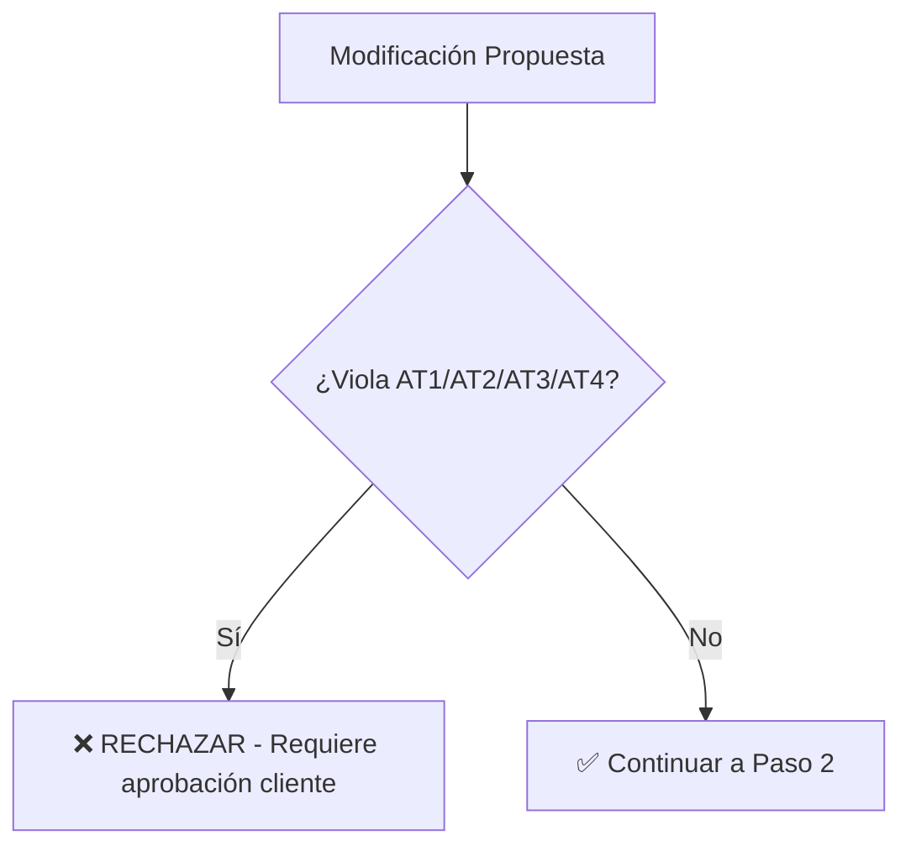

# 📚 FUENTES DE VERDAD - JERARQUÍA Y ORDEN DE VALIDACIÓN

**Proyecto:** TM01 Troncal Magdalena  
**Versión:** 1.0  
**Fecha:** 22 de Enero 2026  
**Estado:** ✅ DOCUMENTO OFICIAL

---

## 🎯 PRINCIPIO FUNDAMENTAL

> **"Contract-First Architecture"**
> 
> Los documentos contractuales (C1, AT1-AT4) tienen **prioridad absoluta** sobre cualquier otro documento técnico.
> Si hay conflicto, el contrato SIEMPRE gana.

---

## 📊 JERARQUÍA DE FUENTES DE VERDAD

### **NIVEL 1: DOCUMENTOS CONTRACTUALES (Inmutables)**

Estos documentos **NO pueden ser modificados** sin aprobación formal del cliente:

```
I. Contrato General/
├── C1_Contrato_Principal.pdf                    # ⭐ MÁXIMA AUTORIDAD
└── Anexos_Contractuales/

II. Apendices Tecnicos/
├── AT1_Alcance_Tecnico.md                        # ⭐ Cantidades contractuales
├── AT2_Especificaciones_Recaudo.md               # ⭐ Requisitos de peajes
├── AT3_Requisitos_ITS.md                         # ⭐ Sistemas ITS obligatorios
└── AT4_Normativa_Aplicable.md                    # ⭐ Normativas vigentes
```

**Reglas:**
- ✅ Si AT1 dice "88 postes SOS", ese es el número oficial
- ✅ Si AT2 especifica "IP/REV compliance", es obligatorio
- ✅ Si AT4 cita "RETIE 2024", esa es la norma a aplicar
- ❌ **NUNCA** modificar estos archivos sin autorización

---

### **NIVEL 2: INGENIERÍA DE DETALLE (T05) - Fuente de Precios**

Estos documentos contienen los **precios definitivos** y **componentes detallados**:

```
V. Ingenieria de Detalle/
├── 04_T05_Ingenieria_Detalle_Postes_SOS_v1.0.md          # 💰 Precios SOS
├── 05_T05_Ingenieria_Detalle_CCTV_v1.0.md                # 💰 Precios CCTV
├── 06_T05_Ingenieria_Detalle_PMV_v1.0.md                 # 💰 Precios PMV
├── 07_T05_Ingenieria_Detalle_RADAR_ETD_v1.0.md           # 💰 Precios ETD/Radar
├── 09_T05_Ingenieria_Detalle_Estaciones_Meteorologicas_v1.0.md
├── 10_T05_Ingenieria_Detalle_WIM_v1.0.md                 # 💰 Precios WIM
├── 11_T05_Ingenieria_Detalle_Peaje_v1.0.md               # 💰 Precios Peajes
└── 01_T05_Ingenieria_Detalle_Fibra_Optica_v1.0.md        # 💰 Precios Fibra
```

**Reglas:**
- ✅ Estos documentos definen **precios unitarios** y **totales**
- ✅ Contienen tablas de componentes con cantidades y costos
- ✅ Son la fuente para `sync_wbs_tm01.ps1`
- ⚠️ Deben ser **consistentes con AT1** (cantidades)
- ⚠️ Si hay conflicto con AT1, **AT1 gana** (cantidades), pero T05 define precios

---

### **NIVEL 3: INGENIERÍA BÁSICA (T04) - Especificaciones Técnicas**

Documentos de especificaciones técnicas detalladas:

```
IV. Ingenieria Basica/
├── 01_T04_Especificaciones_Tecnicas_Postes_SOS_v1.0.md
├── 02_T04_Especificaciones_Tecnicas_CCTV_v1.0.md
├── 03_T04_Especificaciones_Tecnicas_PMV_v1.0.md
└── ...
```

**Reglas:**
- ✅ Definen **características técnicas** de equipos
- ✅ Especifican **normativas** a cumplir
- ⚠️ No definen precios (eso es T05)
- ⚠️ Deben ser consistentes con AT3 y AT4

---

### **NIVEL 4: INGENIERÍA CONCEPTUAL (T01/T02/T03) - Contexto**

Documentos de contexto y arquitectura:

```
III. Ingenieria Conceptual/
├── T01_Ficha_Sistema_*.md                        # 📋 Resumen ejecutivo
├── T02_Analisis_Requisitos_*.md                  # 📋 Requisitos funcionales
└── T03_Arquitectura_Conceptual_*.md              # 📋 Diagramas de alto nivel
```

**Reglas:**
- ✅ Proporcionan **contexto** y **justificación**
- ✅ Útiles para entender el "por qué"
- ❌ **NO son fuente de precios** (usar T05)
- ❌ **NO definen cantidades finales** (usar AT1)

---

## 🔄 FLUJO DE VALIDACIÓN CORRECTO

### **Paso 1: Validar Consistencia Contractual**



**Checklist:**
- [ ] ¿Las cantidades coinciden con AT1?
- [ ] ¿Cumple con requisitos de AT2 (recaudo)?
- [ ] ¿Cumple con AT3 (ITS)?
- [ ] ¿Cumple con normativas de AT4?

---

### **Paso 2: Actualizar T05 (Fuente de Precios)**

Si la modificación afecta precios o componentes:

1. **Editar el archivo T05 correspondiente:**
   ```
   V. Ingenieria de Detalle/XX_T05_Ingenieria_Detalle_[SISTEMA]_v1.0.md
   ```

2. **Actualizar tablas de componentes:**
   ```markdown
   | Componente | Cantidad | Precio Unit (USD) | Total (USD) |
   |:-----------|:---------|:------------------|:------------|
   | Poste SOS  | 88       | $25,000          | $2,200,000  |
   ```

3. **Verificar que el TOTAL coincida con el target:**
   - Ejemplo: Peajes debe sumar **$1,890,218.94**

---

### **Paso 3: Ejecutar Script de Sincronización**

⚠️ **CRÍTICO: Este paso es OBLIGATORIO**

```powershell
# Ejecutar desde la raíz del proyecto
powershell -ExecutionPolicy Bypass -File "scripts/sync_wbs_tm01.ps1" -Verbose
```

**¿Qué hace este script?**
1. Lee los archivos T05 (Nivel 2)
2. Extrae componentes, cantidades y precios
3. Valida contra AT1/AT2/AT3/AT4 (Nivel 1)
4. Genera `docs/datos_wbs_TM01_items.js` (Capa 3)
5. Actualiza `docs/data/tm01_master_data.js` si es necesario

**Si NO ejecutas este script:**
- ❌ `presupuesto.html` mostrará datos viejos
- ❌ `wbs.html` mostrará datos viejos
- ❌ `layout.html` mostrará datos viejos

---

### **Paso 4: Verificar Dashboards**

Abrir localmente y verificar:

```powershell
# Opción 1: Servidor web con sincronización automática
powershell -ExecutionPolicy Bypass -File "docs/servidor_web.ps1"

# Opción 2: Abrir directamente
start docs/presupuesto.html
```

**Checklist de verificación:**
- [ ] `presupuesto.html` muestra valores correctos
- [ ] `wbs.html` muestra valores correctos
- [ ] Totales coinciden con T05

---

## 📋 EJEMPLO PRÁCTICO: Actualizar Peajes

### **Escenario:**
Necesitas actualizar el CAPEX de Peajes de $2.08M a $1.89M

### **Proceso Correcto:**

**1. Verificar AT1 (Contractual):**
```bash
# Abrir AT1 y verificar cantidad contractual de peajes
# Ejemplo: "2 estaciones de peaje"
```
✅ Cantidad contractual: **2 estaciones**

**2. Actualizar T05 (Precios):**
```bash
# Editar archivo
V. Ingenieria de Detalle/11_T05_Ingenieria_Detalle_Peaje_v1.0.md
```

Ajustar los precios de los componentes para que sumen **$1,890,218.94**:

```markdown
| Componente | Cantidad | Precio Unit | Total |
|:-----------|:---------|:------------|:------|
| Carril Automático | 4 | $72,056.72 | $288,226.88 |
| Carril Mixto | 4 | $71,560.53 | $286,242.12 |
| ... | ... | ... | ... |
| **TOTAL** | | | **$1,890,218.94** ✅ |
```

**3. Ejecutar Sincronización:**
```powershell
powershell -ExecutionPolicy Bypass -File "scripts/sync_wbs_tm01.ps1" -Verbose
```

**4. Verificar:**
```powershell
# Abrir presupuesto.html
start docs/presupuesto.html

# Verificar que el subtotal de Peajes sea $1,890,218.94
```

**5. Commit:**
```bash
git add "V. Ingenieria de Detalle/11_T05_Ingenieria_Detalle_Peaje_v1.0.md"
git add "docs/datos_wbs_TM01_items.js"
git commit -m "fix(peajes): adjust component prices to match $1.89M target"
git push origin main
```

---

## ⚠️ ERRORES COMUNES

### **Error 1: Editar `datos_wbs_TM01_items.js` directamente**

❌ **INCORRECTO:**
```javascript
// Editando docs/datos_wbs_TM01_items.js manualmente
{ item: '10.1.1', total: '288226.88' }  // ❌ NO HACER ESTO
```

✅ **CORRECTO:**
```markdown
<!-- Editar V. Ingenieria de Detalle/11_T05_Ingenieria_Detalle_Peaje_v1.0.md -->
| Carril Automático | 4 | $72,056.72 | $288,226.88 |

<!-- Luego ejecutar sync_wbs_tm01.ps1 -->
```

---

### **Error 2: Modificar `tm01_master_data.js` sin sincronizar**

❌ **INCORRECTO:**
```javascript
// Editar docs/data/tm01_master_data.js
peajesSummary: {
  capexUSD: 1890218.94  // ✅ Correcto
}
// Pero NO ejecutar sync_wbs_tm01.ps1  // ❌ ERROR
```

✅ **CORRECTO:**
```powershell
# Después de editar tm01_master_data.js
powershell -ExecutionPolicy Bypass -File "scripts/sync_wbs_tm01.ps1"
```

---

### **Error 3: Violar cantidades contractuales**

❌ **INCORRECTO:**
```markdown
<!-- En T05 -->
| Postes SOS | 100 | $25,000 | $2,500,000 |  # ❌ AT1 dice 88
```

✅ **CORRECTO:**
```markdown
<!-- En T05 -->
| Postes SOS | 88 | $25,000 | $2,200,000 |  # ✅ Coincide con AT1
```

---

## 🎯 RESUMEN EJECUTIVO

### **Fuentes de Verdad por Tipo de Dato:**

| Dato | Fuente de Verdad | Archivo |
|:-----|:-----------------|:--------|
| **Cantidades** | AT1 (Contractual) | `II. Apendices Tecnicos/AT1_Alcance_Tecnico.md` |
| **Precios** | T05 (Ingeniería Detalle) | `V. Ingenieria de Detalle/XX_T05_*.md` |
| **Normativas** | AT4 (Contractual) | `II. Apendices Tecnicos/AT4_Normativa_Aplicable.md` |
| **Requisitos Recaudo** | AT2 (Contractual) | `II. Apendices Tecnicos/AT2_Especificaciones_Recaudo.md` |
| **Especificaciones Técnicas** | T04 (Ingeniería Básica) | `IV. Ingenieria Basica/XX_T04_*.md` |

### **Workflow Obligatorio:**

```
1. Modificar T05 (precios/componentes)
   ↓
2. Ejecutar sync_wbs_tm01.ps1
   ↓
3. Verificar dashboards localmente
   ↓
4. Commit y push
   ↓
5. Vercel auto-deploy
```

### **Archivos que NUNCA debes editar manualmente:**

- ❌ `docs/datos_wbs_TM01_items.js` (GENERADO)
- ❌ `docs/layout_datos.js` (GENERADO)
- ❌ `docs/presupuesto_datos.js` (GENERADO)

**Estos archivos son Capa 3 (Datos Intermedios) y se regeneran automáticamente.**

---

**Última actualización:** 22 de Enero 2026  
**Versión:** 1.0  
**Estado:** ✅ DOCUMENTO OFICIAL
