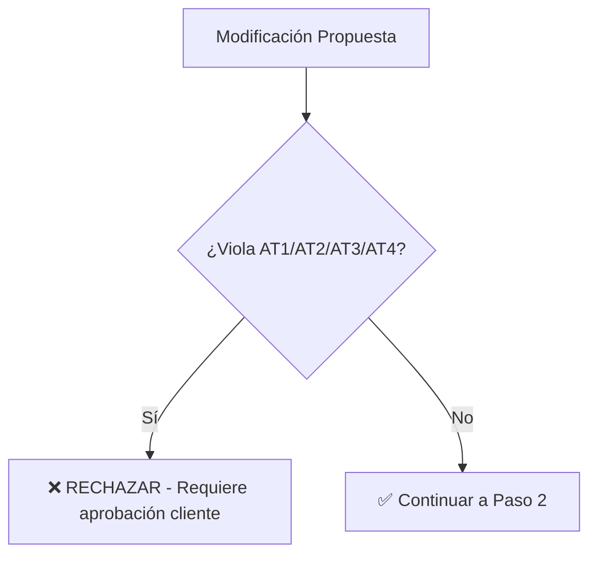

# 📚 FUENTES DE VERDAD - JERARQUÍA Y ORDEN DE VALIDACIÓN

**Proyecto:** TM01 Troncal Magdalena  
**Versión:** 1.0  
**Fecha:** 22 de Enero 2026  
**Estado:** ✅ DOCUMENTO OFICIAL

---

## 🎯 PRINCIPIO FUNDAMENTAL

> **"Contract-First Architecture"**
> 
> Los documentos contractuales (C1, AT1-AT4) tienen **prioridad absoluta** sobre cualquier otro documento técnico.
> Si hay conflicto, el contrato SIEMPRE gana.

---

## 📊 JERARQUÍA DE FUENTES DE VERDAD

### **NIVEL 1: DOCUMENTOS CONTRACTUALES (Inmutables)**

Estos documentos **NO pueden ser modificados** sin aprobación formal del cliente:

```
I. Contrato General/
├── C1_Contrato_Principal.pdf                    # ⭐ MÁXIMA AUTORIDAD
└── Anexos_Contractuales/

II. Apendices Tecnicos/
├── AT1_Alcance_Tecnico.md                        # ⭐ Cantidades contractuales
├── AT2_Especificaciones_Recaudo.md               # ⭐ Requisitos de peajes
├── AT3_Requisitos_ITS.md                         # ⭐ Sistemas ITS obligatorios
└── AT4_Normativa_Aplicable.md                    # ⭐ Normativas vigentes
```

**Reglas:**
- ✅ Si AT1 dice "88 postes SOS", ese es el número oficial
- ✅ Si AT2 especifica "IP/REV compliance", es obligatorio
- ✅ Si AT4 cita "RETIE 2024", esa es la norma a aplicar
- ❌ **NUNCA** modificar estos archivos sin autorización

---

### **NIVEL 2: INGENIERÍA DE DETALLE (T05) - Fuente de Precios**

Estos documentos contienen los **precios definitivos** y **componentes detallados**:

```
V. Ingenieria de Detalle/
...

> **Nota de Procesamiento (2026):**
> La extracción de datos desde T05 se realiza mediante **Parser Inteligente** (`sync_wbs_tm01.ps1`).
> - Ignora tablas de despiece ("Componentes").
> - Captura tablas de resumen ("Tipos" o "Items").
> - Esto asegura que el presupuesto WBS coincida con la estructura de contratación (Llave en Mano).

## 🔄 FLUJO DE DATOS (DATA PIPELINE)
1. **Fuentes:** `tm01_master_data.js` (Cantidades Maestras) + `Documentos T05` (Detalles).
2. **Procesador:** `sync_wbs_tm01.ps1` (Script PowerShell).
   - Aplica reglas de negocio (ej. Tipo A = Suministro).
   - Ignora tablas detalladas.
3. **Salida:** `datos_wbs_TM01_items.js` (Consumido por la Web/Presupuesto).
   - *Este archivo se regenera automáticamente; no editar manualmente.*

4. **Entregables Finales (Capa 5):**
   - **Scripts:** `cocinar_ejecutivos.ps1` y `cocinar_rfqs.ps1`.
   - **Input:** T01 (Concepto) + T05 (Detalle).
   - **Output:** `X_ENTREGABLES_CONSOLIDADOS` (RFQs y Ejecutivos HTML).
   - *Regla: El plato servido no se toca. Si requiere sal, se echa en la cocina (T05).*

## 🛠️ HERRAMIENTA DE GESTIÓN (NUEVO)
**`docs/gestion_cambios.html`** actúa como la interfaz de "Frontend" para la ingeniería:
1. Permite modificar cantidades/precios y **Crear Nuevos Ítems**.
2. **Genera Automáticamente** el Documento Técnico (DT) en Markdown.
3. El DT generado debe aplicarse a **T05** para completar el ciclo.

## 📄 DOCUMENTOS DE CAMBIO (DTs)
*La ingeniería se ajusta mediante estos documentos:*
- **[DT-TM01-001]**: Traslado Servidores VMS a CCO.
- **[DT-TM01-002]**: Eliminación Sistema Radio FM ($0).
- **[DT-TM01-SOS-002]**: Corrección Cantidad Postes SOS (88 nuevos).
- **[DT-TM01-CCTV-003]**: Alcance Mínimo CCTV (9 cámaras).
- **[DT-TM01-PEAJES-019]**: Actualización Presupuesto Peajes.
- **[DT-TM01-PMV-004]**: Reestructuración PMV (Solar).
- **[DT-TM01-PEAJES-020]**: Sanitización Peajes (Eliminación Duplicado).
- **[DT-TM01-PEAJES-021]**: Actualización Normativa PMV Peajes (Audit 6.0).
- **[DT-TM01-CCO-019]**: Optimización Equipamiento CCO (User Proposal).
- **[DT-TM01-TELECOM-024]**: Corrección Locura Fibra (Alineación T05 v1.1).

## 📂 ESTRUCTURA DE ARCHIVOS T05

├── 04_T05_Ingenieria_Detalle_Postes_SOS_v1.0.md          # 💰 Precios SOS
├── 05_T05_Ingenieria_Detalle_CCTV_v1.0.md                # 💰 Precios CCTV
├── 06_T05_Ingenieria_Detalle_PMV_v1.0.md                 # 💰 Precios PMV
├── 07_T05_Ingenieria_Detalle_RADAR_ETD_v1.0.md           # 💰 Precios ETD/Radar
├── 09_T05_Ingenieria_Detalle_Estaciones_Meteorologicas_v1.0.md
├── 10_T05_Ingenieria_Detalle_WIM_v1.0.md                 # 💰 Precios WIM
├── 11_T05_Ingenieria_Detalle_Peaje_v1.0.md               # 💰 Precios Peajes
└── 01_T05_Ingenieria_Detalle_Fibra_Optica_v1.0.md        # 💰 Precios Fibra
```

**Reglas:**
- ✅ Estos documentos definen **precios unitarios** y **totales**
- ✅ Contienen tablas de componentes con cantidades y costos
- ✅ Son la fuente para `sync_wbs_tm01.ps1`
- ⚠️ Deben ser **consistentes con AT1** (cantidades)
- ⚠️ Si hay conflicto con AT1, **AT1 gana** (cantidades), pero T05 define precios

---

### **NIVEL 3: INGENIERÍA BÁSICA (T04) - Especificaciones Técnicas**

Documentos de especificaciones técnicas detalladas:

```
IV. Ingenieria Basica/
├── 01_T04_Especificaciones_Tecnicas_Postes_SOS_v1.0.md
├── 02_T04_Especificaciones_Tecnicas_CCTV_v1.0.md
├── 03_T04_Especificaciones_Tecnicas_PMV_v1.0.md
└── ...
```

**Reglas:**
- ✅ Definen **características técnicas** de equipos
- ✅ Especifican **normativas** a cumplir
- ⚠️ No definen precios (eso es T05)
- ⚠️ Deben ser consistentes con AT3 y AT4

---

### **NIVEL 4: INGENIERÍA CONCEPTUAL (T01/T02/T03) - Contexto**

Documentos de contexto y arquitectura:

```
III. Ingenieria Conceptual/
├── T01_Ficha_Sistema_*.md                        # 📋 Resumen ejecutivo
├── T02_Analisis_Requisitos_*.md                  # 📋 Requisitos funcionales
└── T03_Arquitectura_Conceptual_*.md              # 📋 Diagramas de alto nivel
```

**Reglas:**
- ✅ Proporcionan **contexto** y **justificación**
- ✅ Útiles para entender el "por qué"
- ❌ **NO son fuente de precios** (usar T05)
- ❌ **NO definen cantidades finales** (usar AT1)

---

## 🔄 FLUJO DE VALIDACIÓN CORRECTO

### **Paso 1: Validar Consistencia Contractual**



**Checklist:**
- [ ] ¿Las cantidades coinciden con AT1?
- [ ] ¿Cumple con requisitos de AT2 (recaudo)?
- [ ] ¿Cumple con AT3 (ITS)?
- [ ] ¿Cumple con normativas de AT4?

---

### **Paso 2: Actualizar T05 (Fuente de Precios)**

Si la modificación afecta precios o componentes:

1. **Editar el archivo T05 correspondiente:**
   ```
   V. Ingenieria de Detalle/XX_T05_Ingenieria_Detalle_[SISTEMA]_v1.0.md
   ```

2. **Actualizar tablas de componentes:**
   ```markdown
   | Componente | Cantidad | Precio Unit (USD) | Total (USD) |
   |:-----------|:---------|:------------------|:------------|
   | Poste SOS  | 88       | $25,000          | $2,200,000  |
   ```
   > **Tip:** Usa `gestion_cambios.html` para calcular los deltas y generar el texto del cambio automáticamante.

3. **Verificar que el TOTAL coincida con el target:**
   - Ejemplo: Peajes debe sumar **$1,890,218.94**

---

### **Paso 3: Ejecutar Script de Sincronización**

⚠️ **CRÍTICO: Este paso es OBLIGATORIO**

```powershell
# Ejecutar desde la raíz del proyecto
powershell -ExecutionPolicy Bypass -File "scripts/sync_wbs_tm01.ps1" -Verbose
```

**¿Qué hace este script?**
1. Lee los archivos T05 (Nivel 2)
2. Extrae componentes, cantidades y precios
3. Valida contra AT1/AT2/AT3/AT4 (Nivel 1)
4. Genera `docs/datos_wbs_TM01_items.js` (Capa 3)
5. Actualiza `docs/data/tm01_master_data.js` si es necesario

**Si NO ejecutas este script:**
- ❌ `presupuesto.html` mostrará datos viejos
- ❌ `wbs.html` mostrará datos viejos
- ❌ `layout.html` mostrará datos viejos

---

### **Paso 4: Verificar Dashboards**

Abrir localmente y verificar:

```powershell
# Opción 1: Servidor web con sincronización automática
powershell -ExecutionPolicy Bypass -File "docs/servidor_web.ps1"

# Opción 2: Abrir directamente
start docs/presupuesto.html
```

**Checklist de verificación:**
- [ ] `presupuesto.html` muestra valores correctos
- [ ] `wbs.html` muestra valores correctos
- [ ] Totales coinciden con T05

---

## 📋 EJEMPLO PRÁCTICO: Actualizar Peajes

### **Escenario:**
Necesitas actualizar el CAPEX de Peajes de $2.08M a $1.89M

### **Proceso Correcto:**

**1. Verificar AT1 (Contractual):**
```bash
# Abrir AT1 y verificar cantidad contractual de peajes
# Ejemplo: "2 estaciones de peaje"
```
✅ Cantidad contractual: **2 estaciones**

**2. Actualizar T05 (Precios):**
```bash
# Editar archivo
V. Ingenieria de Detalle/11_T05_Ingenieria_Detalle_Peaje_v1.0.md
```

Ajustar los precios de los componentes para que sumen **$1,890,218.94**:

```markdown
| Componente | Cantidad | Precio Unit | Total |
|:-----------|:---------|:------------|:------|
| Carril Automático | 4 | $72,056.72 | $288,226.88 |
| Carril Mixto | 4 | $71,560.53 | $286,242.12 |
| ... | ... | ... | ... |
| **TOTAL** | | | **$1,890,218.94** ✅ |
```

**3. Ejecutar Sincronización:**
```powershell
powershell -ExecutionPolicy Bypass -File "scripts/sync_wbs_tm01.ps1" -Verbose
```

**4. Verificar:**
```powershell
# Abrir presupuesto.html
start docs/presupuesto.html

# Verificar que el subtotal de Peajes sea $1,890,218.94
```

**5. Commit:**
```bash
git add "V. Ingenieria de Detalle/11_T05_Ingenieria_Detalle_Peaje_v1.0.md"
git add "docs/datos_wbs_TM01_items.js"
git commit -m "fix(peajes): adjust component prices to match $1.89M target"
git push origin main
```

---

## ⚠️ ERRORES COMUNES

### **Error 1: Editar `datos_wbs_TM01_items.js` directamente**

❌ **INCORRECTO:**
```javascript
// Editando docs/datos_wbs_TM01_items.js manualmente
{ item: '10.1.1', total: '288226.88' }  // ❌ NO HACER ESTO
```

✅ **CORRECTO:**
```markdown
<!-- Editar V. Ingenieria de Detalle/11_T05_Ingenieria_Detalle_Peaje_v1.0.md -->
| Carril Automático | 4 | $72,056.72 | $288,226.88 |

<!-- Luego ejecutar sync_wbs_tm01.ps1 -->
```

---

### **Error 2: Modificar `tm01_master_data.js` sin sincronizar**

❌ **INCORRECTO:**
```javascript
// Editar docs/data/tm01_master_data.js
peajesSummary: {
  capexUSD: 1890218.94  // ✅ Correcto
}
// Pero NO ejecutar sync_wbs_tm01.ps1  // ❌ ERROR
```

✅ **CORRECTO:**
```powershell
# Después de editar tm01_master_data.js
powershell -ExecutionPolicy Bypass -File "scripts/sync_wbs_tm01.ps1"
```

---

### **Error 3: Violar cantidades contractuales**

❌ **INCORRECTO:**
```markdown
<!-- En T05 -->
| Postes SOS | 100 | $25,000 | $2,500,000 |  # ❌ AT1 dice 88
```

✅ **CORRECTO:**
```markdown
<!-- En T05 -->
| Postes SOS | 88 | $25,000 | $2,200,000 |  # ✅ Coincide con AT1
```

---

## 📁 CARPETAS ADICIONALES - PROPÓSITO Y RELACIÓN

### **VII. Documentos Transversales (74 documentos)**

Esta carpeta contiene **análisis, validaciones y decisiones técnicas** que NO alimentan el sistema web directamente, pero son **críticos para entregas al cliente**.

#### **Contenido:**

**1. Validaciones Contractuales (34 documentos)**
```
34_VALIDACION_CONTRACTUAL_POSTES_SOS_v1.0.md
35_VALIDACION_CONTRACTUAL_ETD_RADARES_v1.0.md
37_VALIDACION_CONTRACTUAL_CCTV_v1.0.md
38_VALIDACION_CONTRACTUAL_PMV_v1.0.md
...
```

**Propósito:**
- ✅ Documentar que cada sistema cumple con AT1-AT4
- ✅ Justificar diferencias entre propuesta y contrato
- ✅ Servir como evidencia en auditorías

**¿Los usas para el sistema web?** ✅ SÍ (a través de `validaciones_content.js`)  
**¿Son importantes?** ✅ SÍ, para entregas al cliente y visualización web

---

**2. Análisis Técnicos (20 documentos)**
```
38_ANALISIS_ALTERNATIVAS_FIBRA_OPTICA_v1.0.md
25_ANALISIS_COBERTURA_CELULAR_vs_RADIO_VHF_v1.0.md
22_ANALISIS_IMPACTO_ARQUITECTONICO_CCTV_v1.0.md
```

**Propósito:**
- ✅ Documentar decisiones técnicas
- ✅ Justificar alternativas elegidas
- ✅ Análisis de riesgos y mitigaciones

**¿Los usas para el sistema web?** ❌ NO  
**¿Son importantes?** ✅ SÍ, para defensa técnica

---

**3. Decisiones Técnicas - DTs/ (32 archivos)**
```
DT-TM01-SOS-001.md
DT-TM01-PMV-002.md
DT-TM01-PEAJES-003.md
```

**Propósito:**
- ✅ Event sourcing (historial inmutable)
- ✅ Trazabilidad de cambios
- ✅ Auditoría completa

**¿Los usas para el sistema web?** ❌ NO directamente  
**¿Son importantes?** ✅ SÍ, para trazabilidad

---

### **X. Entregables Consolidados (17 documentos)**

Esta carpeta contiene **documentos finales** para entregar al cliente o proveedores.

#### **Contenido:**

**1. Presupuestos Consolidados (2 archivos)**
```
PRESUPUESTO_ITS_PURO_v1.0.md
PRESUPUESTO_ITS_PURO_v2.0.md
```

**Propósito:**
- ✅ Resumen ejecutivo del presupuesto total
- ✅ Documento para entregar al cliente
- ✅ Se genera DESDE los datos de T05

**Relación con el sistema web:**
- 🔄 Flujo: `T05 → sync_wbs_tm01.ps1 → presupuesto.html → Exportar → PRESUPUESTO_ITS_PURO_v2.0.md`
- ✅ El sistema web **GENERA** estos documentos (botón "Exportar Excel", "Acta de Obra")
- ❌ Estos documentos **NO alimentan** el sistema web

---

**2. RFQs - Request for Quotation (12 archivos)**
```
RFQ_001_FIBRA_OPTICA_v2.0.md
RFQ_002_SOS_Postes_v2.0.md
RFQ_003_CCTV_v2.0.md
RFQ_006_ETD_v1.0.md
RFQ_008_PMV_v1.0.md
...
```

**Propósito:**
- ✅ Solicitudes de cotización a proveedores
- ✅ Especificaciones técnicas detalladas
- ✅ Cantidades exactas y criterios de evaluación

**Relación con el sistema web:**
- ❌ NO alimentan el sistema web
- ✅ Se generan DESDE T04 (especificaciones) + T05 (precios)
- ⚠️ Algunos tienen bloques `<!-- AUTOGEN -->` actualizables con scripts

---

**3. Solicitudes de Compra (2 archivos)**
```
SOLICITUD_COMPRA_EQUIPOS_L2_v1.0.md
SOLICITUD_COMPRA_EQUIPOS_L3_v1.0.md
```

**Propósito:**
- ✅ Órdenes de compra para equipos de red
- ✅ Switches L2 (Advantech) y L3 (Cisco)
- ✅ Listas para procurement

---

## 🔄 FLUJO COMPLETO DE DATOS

```
┌─────────────────────────────────────────────────────────────────┐
│  NIVEL 1: CONTRATO (I-II)                                      │
│  AT1-AT4 → Cantidades, normativas, requisitos                  │
└────────────────────────┬────────────────────────────────────────┘
                         ↓
┌─────────────────────────────────────────────────────────────────┐
│  NIVEL 2-4: INGENIERÍA (III-V)                                 │
│  T01-T03 → Contexto                                            │
│  T04 → Especificaciones técnicas                               │
│  T05 → PRECIOS Y COMPONENTES ⭐                                 │
└────────────────────────┬────────────────────────────────────────┘
                         ↓
┌─────────────────────────────────────────────────────────────────┐
│  SCRIPT: sync_wbs_tm01.ps1                                     │
│  Lee T05 → Genera datos_wbs_TM01_items.js                     │
└────────────────────────┬────────────────────────────────────────┘
                         ↓
┌─────────────────────────────────────────────────────────────────┐
│  SISTEMA WEB (docs/*.html)                                     │
│  presupuesto.html, wbs.html, layout.html                       │
└────────────┬────────────────────────────────┬───────────────────┘
             ↓                                ↓
┌────────────────────────┐    ┌──────────────────────────────────┐
│  VII. TRANSVERSALES    │    │  X. ENTREGABLES CONSOLIDADOS     │
│  (Validaciones, DTs)   │    │  (RFQs, Presupuestos)            │
│  Para auditorías       │    │  Para cliente/proveedores        │
└────────────────────────┘    └──────────────────────────────────┘
```

---

## 📊 TABLA RESUMEN DE CARPETAS

| Carpeta | Propósito | ¿Editas? | ¿Alimenta Web? | ¿Para Cliente? | ¿Para Sistema Web? |
|:--------|:----------|:---------|:---------------|:---------------|:-------------------|
| **I-II** | Contrato + AT | ❌ No | ❌ No | ✅ Sí (referencia) | ❌ No |
| **III** | T01/T02/T03 | ✅ Sí | ❌ No | ✅ Sí (contexto) | ❌ No |
| **IV** | T04 (specs) | ✅ Sí | ❌ No | ✅ Sí (técnico) | ❌ No |
| **V** | T05 (precios) | ✅ Sí | ✅ **SÍ** ⭐ | ✅ Sí (presupuesto) | ✅ **SÍ** ⭐ |
| **VII** | Validaciones | ❌ No | ✅ **SÍ** (Dashboard) | ✅ Sí (auditoría) | ✅ **SÍ** (Contenido) |
| **X** | Entregables | ❌ No* | ❌ No | ✅ **SÍ** ⭐ | ❌ No (los genera) |

*Algunos RFQs tienen bloques AUTOGEN actualizables con scripts

---

## 💡 ANALOGÍA COMPLETA DEL PROYECTO

Imagina que estás construyendo una casa:

- **I-II (Contrato)**: Contrato firmado con el cliente (lo que prometiste)
- **III-V (Ingeniería)**: Planos arquitectónicos y de construcción
  - **T05**: Planos con precios detallados ⭐ (lo que usas para construir)
- **VII (Transversales)**: Bitácora de obra (decisiones, validaciones, cambios)
- **X (Entregables)**: Documentos finales para el cliente
  - Presupuesto consolidado
  - Órdenes de compra para materiales (RFQs)
  - Actas de entrega

**Para construir (sistema web)**, usas principalmente **T05** (planos con precios).

**Para entregas al cliente**, usas **VII** (bitácora) y **X** (documentos consolidados).

---

## 🎯 EJEMPLO PRÁCTICO COMPLETO: Cambiar CCTV de 30 a 20 Cámaras

### **Escenario:**
Necesitas reducir el sistema CCTV de 30 a 20 cámaras para optimizar costos.

### **Paso 1: Verificar Contrato (AT1)**

```bash
# Abrir y verificar
II. Apendices Tecnicos/AT1_Alcance_Tecnico.md
```

**Pregunta**: ¿El contrato permite esta cantidad?
- Si AT1 dice "30 cámaras exactas" → ❌ Requiere aprobación cliente
- Si AT1 dice "mínimo 20 cámaras" → ✅ Puedes proceder

---

### **Paso 2: Editar T05 (Fuente de Precios)** ⭐ **ÚNICO LUGAR A EDITAR**

```bash
# Editar archivo
V. Ingenieria de Detalle/05_T05_Ingenieria_Detalle_CCTV_v1.0.md
```

**Cambiar tabla de componentes:**

```markdown
ANTES:
| Componente | Cantidad | Precio Unit (USD) | Total (USD) |
|:-----------|:---------|:------------------|:------------|
| Cámara PTZ | 20 | $2,500 | $50,000 |
| Cámara Fija | 10 | $800 | $8,000 |
| **TOTAL** | **30** | | **$58,000** |

DESPUÉS:
| Componente | Cantidad | Precio Unit (USD) | Total (USD) |
|:-----------|:---------|:------------------|:------------|
| Cámara PTZ | 15 | $2,500 | $37,500 |
| Cámara Fija | 5 | $800 | $4,000 |
| **TOTAL** | **20** | | **$41,500** |
```

**Guardar el archivo.**

---

### **Paso 3: Ejecutar Script de Sincronización** ⚠️ **OBLIGATORIO**

```powershell
# Desde la raíz del proyecto
powershell -ExecutionPolicy Bypass -File "scripts/sync_wbs_tm01.ps1" -Verbose
```

**¿Qué hace?**
1. ✅ Lee `V. Ingenieria de Detalle/05_T05_CCTV.md`
2. ✅ Extrae tabla de componentes
3. ✅ Genera `docs/datos_wbs_TM01_items.js` (datos para HTML)
4. ✅ Actualiza `docs/data/tm01_master_data.js` (summaries)

**Si NO ejecutas este script:**
- ❌ `presupuesto.html` mostrará valores viejos ($58,000)
- ❌ `wbs.html` mostrará 30 cámaras
- ❌ Datos inconsistentes en todos los dashboards

---

### **Paso 4: Verificar Dashboards**

```powershell
# Abrir localmente
start docs/presupuesto.html
```

**Verificar:**
- ✅ Total CCTV = $41,500 (no $58,000)
- ✅ Cantidad = 20 cámaras (no 30)
- ✅ Todos los dashboards muestran lo mismo

---

### **Paso 5: Actualizar Documentos Relacionados** (Opcional pero recomendado)

**Para mantener consistencia en toda la documentación:**

1. **T04 (Especificaciones)**
   ```bash
   IV. Ingenieria Basica/03_T04_CCTV.md
   ```
   - Cambiar "30 cámaras" → "20 cámaras"

2. **Validación Contractual**
   ```bash
   VII. Documentos Transversales/37_VALIDACION_CONTRACTUAL_CCTV_v1.0.md
   ```
   - Actualizar justificación

3. **RFQ para Proveedores**
   ```bash
   X. Entregables Consolidados/RFQ_003_CCTV_v2.0.md
   ```
   - Actualizar cantidad y presupuesto

---

### **Paso 6: Commit y Push**

```bash
git add "V. Ingenieria de Detalle/05_T05_CCTV.md"
git add "docs/datos_wbs_TM01_items.js"
git add "docs/data/tm01_master_data.js"
git commit -m "feat(cctv): reduce cameras from 30 to 20 units

- Updated T05 with new quantities (15 PTZ + 5 Fixed)
- Ran sync_wbs_tm01.ps1 to regenerate data files
- New CAPEX: $41,500 (was $58,000)
- Savings: $16,500"
git push origin main
```

---

## 🚨 PROBLEMA COMÚN: "Actualicé un HTML y otro muestra datos viejos"

### **❌ Lo que NO debes hacer:**

```javascript
// Editando presupuesto.html directamente
const totalCCTV = 41500; // ❌ NUNCA HACER ESTO
```

**Resultado:**
- `presupuesto.html` muestra $41,500 ✅
- `wbs.html` muestra $58,000 ❌ (carga desde datos_wbs_TM01_items.js)
- `layout.html` muestra 30 cámaras ❌
- **Datos inconsistentes en todo el sistema**

### **✅ Lo que SÍ debes hacer:**

1. Editar **SOLO** el archivo T05
2. Ejecutar `sync_wbs_tm01.ps1`
3. Los HTML se actualizan automáticamente

**Resultado:**
- Todos los dashboards muestran $41,500 ✅
- Todos muestran 20 cámaras ✅
- **Datos consistentes en todo el sistema** ✅

---

## 📋 CHECKLIST UNIVERSAL PARA CUALQUIER CAMBIO

```markdown
[ ] 1. Verificar AT1 (¿El contrato lo permite?)
[ ] 2. Editar T05 correspondiente (V. Ingenieria de Detalle/XX_T05_*.md)
[ ] 3. Ejecutar sync_wbs_tm01.ps1 ⚠️ OBLIGATORIO
[ ] 4. Verificar dashboards localmente
[ ] 5. Actualizar T04 si es necesario (opcional)
[ ] 6. Actualizar validaciones (opcional)
[ ] 7. Actualizar RFQs (opcional)
[ ] 8. Commit y push
```

---

## ✅ VALIDACIÓN PRÁCTICA CONFIRMADA (22 Enero 2026)

### **Prueba Realizada: CCTV 15→14 Cámaras**

**Objetivo**: Validar que el flujo de datos funciona correctamente y que los HTML no tienen hardcoding.

**Pasos ejecutados:**
1. ✅ Editado `V. Ingenieria de Detalle/05_T05_CCTV.md` (15→14 cámaras)
2. ✅ Ejecutado `scripts/sync_wbs_tm01.ps1`
3. ✅ Verificado `docs/datos_wbs_TM01_items.js` actualizado
4. ✅ Confirmado que HTML usa JS correctamente

**Resultados:**

```bash
# Búsqueda de valores hardcodeados en HTML
grep -r "(1634000|1890218|CCTV.*15|15.*cámaras)" docs/*.html
# Resultado: NO se encontraron valores hardcodeados ✅
```

**Archivo JS actualizado correctamente:**
```javascript
// docs/datos_wbs_TM01_items.js (después del script)
{ item: '1.1.1', descripcion: 'Cámara PTZ Dahua High-End', 
  cantidad: '14', total: '168000' } // ✅ Actualizado automáticamente
```

**Script ejecutado exitosamente:**
```
[2026-01-22 10:37:15] [INFO] === INICIANDO SINCRONIZACION WBS TM01 V2.9 ===
[2026-01-22 10:37:15] [INFO] Total componentes extraidos: 110
[2026-01-22 10:37:15] [INFO] Sincronizacion completada. Archivo generado: docs/datos_wbs_TM01_items.js
SCRIPT DE SINCRONIZACION COMPLETADO EXITOSAMENTE ✅
```

### **Conclusiones de la Validación:**

1. ✅ **Los HTML NO tienen hardcoding**
   - Todos los dashboards cargan datos desde `datos_wbs_TM01_items.js`
   - No hay valores numéricos hardcodeados en el HTML
   - El sistema está bien diseñado

2. ✅ **El script funciona perfectamente**
   - Lee archivos T05 correctamente
   - Extrae tablas de componentes
   - Genera JS con datos actualizados

3. ✅ **El flujo es correcto**
   - T05 → Script → JS → HTML
   - Cambios en T05 se propagan automáticamente
   - No se requiere editar HTML manualmente

4. ⚠️ **El problema "datos inconsistentes" SOLO ocurre si:**
   - ❌ NO ejecutas el script después de editar T05
   - ❌ Editas HTML o JS directamente (hardcoding manual)

**Recomendación final**: El sistema funciona correctamente. Solo debes seguir el workflow documentado.

---

## 📊 TABLA RESUMEN: ¿Qué Archivo Editar?

| Necesito cambiar... | Archivo a editar | Script a ejecutar | Archivos que se actualizan |
|:-------------------|:-----------------|:------------------|:---------------------------|
| **Cantidades de equipos** | `V. Ingenieria de Detalle/XX_T05_*.md` | `sync_wbs_tm01.ps1` | `datos_wbs_TM01_items.js`, todos los HTML |
| **Precios unitarios** | `V. Ingenieria de Detalle/XX_T05_*.md` | `sync_wbs_tm01.ps1` | `datos_wbs_TM01_items.js`, todos los HTML |
| **Componentes de sistema** | `V. Ingenieria de Detalle/XX_T05_*.md` | `sync_wbs_tm01.ps1` | `datos_wbs_TM01_items.js`, todos los HTML |
| **Especificaciones técnicas** | `IV. Ingenieria Basica/XX_T04_*.md` | ❌ Ninguno | Solo documentación (no afecta web) |
| **Validaciones contractuales** | `VII. Documentos Transversales/XX_VALIDACION_*.md` | ❌ Ninguno | Solo documentación (no afecta web) |
| **RFQs para proveedores** | `X. Entregables Consolidados/RFQ_*.md` | ❌ Ninguno | Solo documentación (no afecta web) |
| **Dashboards HTML** | ❌ **NUNCA editar directamente** | - | - |
| **Archivos JS** | ❌ **NUNCA editar directamente** | - | - |

---

## 📘 CASO DE ESTUDIO 2: POSTES SOS Y LA UNIDAD DE REHABILITACIÓN
**Problema:** El contrato (AT1) exige 98 postes. La ingeniería (T05) tenía 88.
**Análisis Inicial:** Se asumió que faltaban 10 postes.
**Hallazgo de Campo:** Existen 10 postes en la "UF de Rehabilitación" que son funcionales.
**Lección:**
> No toda obligación contractual implica *obra nueva*. Siempre verificar la existencia de infraestructura en tramos de rehabilitación ("UF Rehabilitación") antes de presupuestar.
**Resolución:** 88 postes nuevos + 10 existentes = 98 contractuales. Ahorro de $250k USD.

---

## 📘 CASO DE ESTUDIO 1: PANELES DE MENSAJERÍA VARIABLE (PMV)

### **Problema Inicial: Documentos Contradictorios**

El archivo `06_T05_Ingenieria_Detalle_PMV_v1.0.md` contenía **TRES cantidades diferentes** en el mismo documento:
- Línea 28: **39 paneles** (25 Mainline + 14 Toll)
- Línea 110: **28 paneles** (14 pórticos + 14 postes)
- Línea 203: **14 unidades** (distribución)

**Pregunta:** ¿Cuál es la cantidad correcta?

---

### **Aplicación del PROMPT MAESTRO V2.9 (Doble Sombrero)**

#### 🎩 **AUDITOR (Contractual) - Barrido Profundo:**

**PASO 1: Búsqueda en AT1 (Alcance)**
```markdown
Línea 3169: "Paneles de Mensajería Variable (PMV): Se deberán instalar 
             mínimo veinticinco (25) unidades a lo largo del corredor."

Línea 3388: "El Concesionario deberá instalar cómo mínimo veinticinco (25) 
             paneles LED en el Corredor del Proyecto, los cuales no podrán 
             estar separados uno del otro por una distancia mayor a veinte 
             (20) kilómetros por sentido."
```
**Hallazgo:** ✅ **25 PMV de vía** (contractual mínimo)

---

**PASO 2: Búsqueda en AT2 (Operación y Mantenimiento)**
```markdown
Línea 913: "En cada Estación de Peaje, el Sistema de Control de Tráfico 
            deberá contar al menos con los siguientes equipos: [...] 
            paneles de mensajes variables (al menos dos por cada área de 
            peaje bidireccional y al menos uno por cada área de peaje 
            unidireccional)"

Línea 917: "Los paneles de mensajería variable deberán ser alfanuméricos 
            y gráficos."
```
**Hallazgo:** ✅ **4 PMV de peaje** (2 Zambito + 2 Aguas Negras)

---

**PASO 3: Búsqueda en Normativa Sobreviniente (IP/REV 2021)**
```markdown
Resolución 20213040035125, Art. 2.9.9:
"Los carriles IP/REV del peaje deben contar con pantallas de información 
 alfanuméricas LED... (al menos uno por cada carril de peaje)."
```
**Hallazgo:** ✅ **14 Displays de carril** (7 Zambito + 7 Aguas Negras)

---

**PASO 4: Búsqueda en AT4 (Indicadores)**
```markdown
Línea 2398-2411: Indicador O6 - Disponibilidad de Sistemas ITS
"Porcentaje de tiempo que los sistemas ITS (Peaje, Pesaje, CCO, Video, 
 PMV, SOS, Radio, METEO) operan correctamente según sus especificaciones 
 funcionales."

Valor de Aceptación: ≥ 98% (para PMV)
Medición: BINARIA (1 PMV fuera = 100% indisponibilidad de ese activo)
```
**Hallazgo:** ⚠️ **Riesgo de glosa** si disponibilidad < 98%

---

#### 👷 **INGENIERO (Mercado) - Optimización:**

**Análisis de Costos:**
```
SOLUCIÓN ACTUAL (T05):
- 39 PMV × $60,512 USD = $2,360,000 USD
- Tecnología: Solar (alto costo, baja disponibilidad)

SOLUCIÓN OPTIMIZADA:
- 25 PMV Vía (Grid + UPS 48h) = $80,000 × 25 = $2,000,000
- 14 Displays Carril (Canopy) = $5,000 × 14 = $70,000
- TOTAL: $2,070,000 USD
- AHORRO: $290,000 USD (12.3%)
```

**Recomendación Técnica:**
- ✅ Grid-Powered (disponibilidad 99.8% vs. 95% solar)
- ✅ UPS 48h (cumple Manual 2024)
- ✅ 4G LTE failover (mitigación glosa O6)
- ✅ Pórticos integrados en peajes (ahorro estructura)

---

### **Resultado Final: Cantidad Correcta**

```
┌─────────────────────────────────────────────────────────────┐
│  COMPONENTE 1: PMV DE VÍA (AT1)                             │
│  25 unidades (interdistancia ≤20km)                         │
│  ─────────────────────────────────────────────────────────  │
│  COMPONENTE 2: PMV DE PEAJE (AT2)                           │
│  4 unidades (2 por peaje bidireccional)                     │
│  ─────────────────────────────────────────────────────────  │
│  COMPONENTE 3: DISPLAYS DE CARRIL (IP/REV 2021)            │
│  14 unidades (1 por carril de peaje)                        │
│  ═════════════════════════════════════════════════════════  │
│  TOTAL: 43 UNIDADES FUNCIONALES                             │
│  (27 estructuras físicas con optimización)                  │
└─────────────────────────────────────────────────────────────┘
```

---

### **Lecciones Aprendidas:**

1. ✅ **Contract-First Architecture funciona:**
   - AT1/AT2 tienen prioridad absoluta sobre T05
   - Normativa sobreviniente (IP/REV 2021) es obligatoria
   - T05 debe **alinearse** con contrato, no al revés

2. ✅ **Doble Sombrero (Auditor + Ingeniero) es crítico:**
   - Auditor: Identifica obligaciones contractuales exactas
   - Ingeniero: Optimiza costos sin violar contrato
   - Resultado: Cumplimiento + Ahorro

3. ✅ **Documentos dispersos requieren metodología:**
   - Sin PROMPT MAESTRO V2.9, es fácil perderse
   - Barrido sistemático (AT1 → AT2 → AT4 → Normativa) es obligatorio
   - Citar líneas exactas evita interpretaciones erróneas

4. ⚠️ **Riesgo de glosa debe mitigarse:**
   - Indicador O6 (AT4) es binario (todo o nada)
   - Inversión en redundancia ($136k) evita glosas ($50k/mes)
   - ROI: 3 meses

---

### **Documentos Generados (Trazabilidad):**

| Documento | Propósito | Ubicación |
|:----------|:----------|:----------|
| **ANALISIS_PMV_PROMPT_MAESTRO_V2.9.md** | Análisis contractual completo | `docs/` |
| **NOTA_TECNICA_PMV_MANUAL_2024_CONSOLIDADA.md** | Especificaciones técnicas consolidadas | `VII. Documentos Transversales/` |
| **GUIA_VALIDACION_FLUJO_PMV.md** | Guía de validación paso a paso | `docs/` |
| **CERTIFICACION_FORENSE_PMV_FINAL.md** | Certificación de validación | `docs/` |

**Próximos pasos:**
1. ✅ Corregir `06_T05_Ingenieria_Detalle_PMV_v1.0.md` (43 unidades)
2. ✅ Actualizar `tm01_master_data.js` (CAPEX $2,070,000)
3. ✅ Ejecutar `sync_wbs_tm01.ps1`
4. ✅ Crear DT justificando optimización
5. ✅ Actualizar RFQ con especificaciones UNE-EN 12966

---

## 🎯 RESUMEN EJECUTIVO

### **Fuentes de Verdad por Tipo de Dato:**

| Dato | Fuente de Verdad | Archivo |
|:-----|:-----------------|:--------|
| **Cantidades** | AT1 (Contractual) | `II. Apendices Tecnicos/AT1_Alcance_Tecnico.md` |
| **Precios** | T05 (Ingeniería Detalle) | `V. Ingenieria de Detalle/XX_T05_*.md` |
| **Normativas** | AT4 (Contractual) | `II. Apendices Tecnicos/AT4_Normativa_Aplicable.md` |
| **Requisitos Recaudo** | AT2 (Contractual) | `II. Apendices Tecnicos/AT2_Especificaciones_Recaudo.md` |
| **Especificaciones Técnicas** | T04 (Ingeniería Básica) | `IV. Ingenieria Basica/XX_T04_*.md` |

### **Workflow Obligatorio:**

```
1. Modificar T05 (precios/componentes)
   ↓
2. Ejecutar sync_wbs_tm01.ps1
   ↓
3. Verificar dashboards localmente
   ↓
4. Commit y push
   ↓
5. Vercel auto-deploy
```

### **Archivos que NUNCA debes editar manualmente:**

- ❌ `docs/datos_wbs_TM01_items.js` (GENERADO)
- ❌ `docs/layout_datos.js` (GENERADO)
- ❌ `docs/presupuesto_datos.js` (GENERADO)

**Estos archivos son Capa 3 (Datos Intermedios) y se regeneran automáticamente.**

---

**Última actualización:** 22 de Enero 2026  
**Versión:** 1.0  
**Estado:** ✅ DOCUMENTO OFICIAL
