# 📚 FUENTES DE VERDAD - JERARQUÍA Y ORDEN DE VALIDACIÓN

**Proyecto:** TM01 Troncal Magdalena  
**Versión:** 1.0  
**Fecha:** 22 de Enero 2026  
**Estado:** ✅ DOCUMENTO OFICIAL

---

## 🎯 PRINCIPIO FUNDAMENTAL

> **"Contract-First Architecture"**
> 
> Los documentos contractuales (C1, AT1-AT4) tienen **prioridad absoluta** sobre cualquier otro documento técnico.
> Si hay conflicto, el contrato SIEMPRE gana.

---

## 📊 JERARQUÍA DE FUENTES DE VERDAD

### **NIVEL 1: DOCUMENTOS CONTRACTUALES (Inmutables)**

Estos documentos **NO pueden ser modificados** sin aprobación formal del cliente:

```
I. Contrato General/
├── C1_Contrato_Principal.pdf                    # ⭐ MÁXIMA AUTORIDAD
└── Anexos_Contractuales/

II. Apendices Tecnicos/
├── AT1_Alcance_Tecnico.md                        # ⭐ Cantidades contractuales
├── AT2_Especificaciones_Recaudo.md               # ⭐ Requisitos de peajes
├── AT3_Requisitos_ITS.md                         # ⭐ Sistemas ITS obligatorios
└── AT4_Normativa_Aplicable.md                    # ⭐ Normativas vigentes
```

**Reglas:**
- ✅ Si AT1 dice "88 postes SOS", ese es el número oficial
- ✅ Si AT2 especifica "IP/REV compliance", es obligatorio
- ✅ Si AT4 cita "RETIE 2024", esa es la norma a aplicar
- ❌ **NUNCA** modificar estos archivos sin autorización

---

### **NIVEL 2: INGENIERÍA DE DETALLE (T05) - Fuente de Precios**

Estos documentos contienen los **precios definitivos** y **componentes detallados**:

```
V. Ingenieria de Detalle/
├── 04_T05_Ingenieria_Detalle_Postes_SOS_v1.0.md          # 💰 Precios SOS
├── 05_T05_Ingenieria_Detalle_CCTV_v1.0.md                # 💰 Precios CCTV
├── 06_T05_Ingenieria_Detalle_PMV_v1.0.md                 # 💰 Precios PMV
├── 07_T05_Ingenieria_Detalle_RADAR_ETD_v1.0.md           # 💰 Precios ETD/Radar
├── 09_T05_Ingenieria_Detalle_Estaciones_Meteorologicas_v1.0.md
├── 10_T05_Ingenieria_Detalle_WIM_v1.0.md                 # 💰 Precios WIM
├── 11_T05_Ingenieria_Detalle_Peaje_v1.0.md               # 💰 Precios Peajes
└── 01_T05_Ingenieria_Detalle_Fibra_Optica_v1.0.md        # 💰 Precios Fibra
```

**Reglas:**
- ✅ Estos documentos definen **precios unitarios** y **totales**
- ✅ Contienen tablas de componentes con cantidades y costos
- ✅ Son la fuente para `sync_wbs_tm01.ps1`
- ⚠️ Deben ser **consistentes con AT1** (cantidades)
- ⚠️ Si hay conflicto con AT1, **AT1 gana** (cantidades), pero T05 define precios

---

### **NIVEL 3: INGENIERÍA BÁSICA (T04) - Especificaciones Técnicas**

Documentos de especificaciones técnicas detalladas:

```
IV. Ingenieria Basica/
├── 01_T04_Especificaciones_Tecnicas_Postes_SOS_v1.0.md
├── 02_T04_Especificaciones_Tecnicas_CCTV_v1.0.md
├── 03_T04_Especificaciones_Tecnicas_PMV_v1.0.md
└── ...
```

**Reglas:**
- ✅ Definen **características técnicas** de equipos
- ✅ Especifican **normativas** a cumplir
- ⚠️ No definen precios (eso es T05)
- ⚠️ Deben ser consistentes con AT3 y AT4

---

### **NIVEL 4: INGENIERÍA CONCEPTUAL (T01/T02/T03) - Contexto**

Documentos de contexto y arquitectura:

```
III. Ingenieria Conceptual/
├── T01_Ficha_Sistema_*.md                        # 📋 Resumen ejecutivo
├── T02_Analisis_Requisitos_*.md                  # 📋 Requisitos funcionales
└── T03_Arquitectura_Conceptual_*.md              # 📋 Diagramas de alto nivel
```

**Reglas:**
- ✅ Proporcionan **contexto** y **justificación**
- ✅ Útiles para entender el "por qué"
- ❌ **NO son fuente de precios** (usar T05)
- ❌ **NO definen cantidades finales** (usar AT1)

---

## 🔄 FLUJO DE VALIDACIÓN CORRECTO

### **Paso 1: Validar Consistencia Contractual**

```mermaid
graph TD
    A[Modificación Propuesta] --> B{¿Viola AT1/AT2/AT3/AT4?}
    B -->|Sí| C[❌ RECHAZAR - Requiere aprobación cliente]
    B -->|No| D[✅ Continuar a Paso 2]
```



**Checklist:**
- [ ] ¿Las cantidades coinciden con AT1?
- [ ] ¿Cumple con requisitos de AT2 (recaudo)?
- [ ] ¿Cumple con AT3 (ITS)?
- [ ] ¿Cumple con normativas de AT4?

---

### **Paso 2: Actualizar T05 (Fuente de Precios)**

Si la modificación afecta precios o componentes:

1. **Editar el archivo T05 correspondiente:**
   ```
   V. Ingenieria de Detalle/XX_T05_Ingenieria_Detalle_[SISTEMA]_v1.0.md
   ```

2. **Actualizar tablas de componentes:**
   ```markdown
   | Componente | Cantidad | Precio Unit (USD) | Total (USD) |
   |:-----------|:---------|:------------------|:------------|
   | Poste SOS  | 88       | $25,000          | $2,200,000  |
   ```

3. **Verificar que el TOTAL coincida con el target:**
   - Ejemplo: Peajes debe sumar **$1,890,218.94**

---

### **Paso 3: Ejecutar Script de Sincronización**

⚠️ **CRÍTICO: Este paso es OBLIGATORIO**

```powershell
# Ejecutar desde la raíz del proyecto
powershell -ExecutionPolicy Bypass -File "scripts/sync_wbs_tm01.ps1" -Verbose
```

**¿Qué hace este script?**
1. Lee los archivos T05 (Nivel 2)
2. Extrae componentes, cantidades y precios
3. Valida contra AT1/AT2/AT3/AT4 (Nivel 1)
4. Genera `docs/datos_wbs_TM01_items.js` (Capa 3)
5. Actualiza `docs/data/tm01_master_data.js` si es necesario

**Si NO ejecutas este script:**
- ❌ `presupuesto.html` mostrará datos viejos
- ❌ `wbs.html` mostrará datos viejos
- ❌ `layout.html` mostrará datos viejos

---

### **Paso 4: Verificar Dashboards**

Abrir localmente y verificar:

```powershell
# Opción 1: Servidor web con sincronización automática
powershell -ExecutionPolicy Bypass -File "docs/servidor_web.ps1"

# Opción 2: Abrir directamente
start docs/presupuesto.html
```

**Checklist de verificación:**
- [ ] `presupuesto.html` muestra valores correctos
- [ ] `wbs.html` muestra valores correctos
- [ ] Totales coinciden con T05

---

## 📋 EJEMPLO PRÁCTICO: Actualizar Peajes

### **Escenario:**
Necesitas actualizar el CAPEX de Peajes de $2.08M a $1.89M

### **Proceso Correcto:**

**1. Verificar AT1 (Contractual):**
```bash
# Abrir AT1 y verificar cantidad contractual de peajes
# Ejemplo: "2 estaciones de peaje"
```
✅ Cantidad contractual: **2 estaciones**

**2. Actualizar T05 (Precios):**
```bash
# Editar archivo
V. Ingenieria de Detalle/11_T05_Ingenieria_Detalle_Peaje_v1.0.md
```

Ajustar los precios de los componentes para que sumen **$1,890,218.94**:

```markdown
| Componente | Cantidad | Precio Unit | Total |
|:-----------|:---------|:------------|:------|
| Carril Automático | 4 | $72,056.72 | $288,226.88 |
| Carril Mixto | 4 | $71,560.53 | $286,242.12 |
| ... | ... | ... | ... |
| **TOTAL** | | | **$1,890,218.94** ✅ |
```

**3. Ejecutar Sincronización:**
```powershell
powershell -ExecutionPolicy Bypass -File "scripts/sync_wbs_tm01.ps1" -Verbose
```

**4. Verificar:**
```powershell
# Abrir presupuesto.html
start docs/presupuesto.html

# Verificar que el subtotal de Peajes sea $1,890,218.94
```

**5. Commit:**
```bash
git add "V. Ingenieria de Detalle/11_T05_Ingenieria_Detalle_Peaje_v1.0.md"
git add "docs/datos_wbs_TM01_items.js"
git commit -m "fix(peajes): adjust component prices to match $1.89M target"
git push origin main
```

---

## ⚠️ ERRORES COMUNES

### **Error 1: Editar `datos_wbs_TM01_items.js` directamente**

❌ **INCORRECTO:**
```javascript
// Editando docs/datos_wbs_TM01_items.js manualmente
{ item: '10.1.1', total: '288226.88' }  // ❌ NO HACER ESTO
```

✅ **CORRECTO:**
```markdown
<!-- Editar V. Ingenieria de Detalle/11_T05_Ingenieria_Detalle_Peaje_v1.0.md -->
| Carril Automático | 4 | $72,056.72 | $288,226.88 |

<!-- Luego ejecutar sync_wbs_tm01.ps1 -->
```

---

### **Error 2: Modificar `tm01_master_data.js` sin sincronizar**

❌ **INCORRECTO:**
```javascript
// Editar docs/data/tm01_master_data.js
peajesSummary: {
  capexUSD: 1890218.94  // ✅ Correcto
}
// Pero NO ejecutar sync_wbs_tm01.ps1  // ❌ ERROR
```

✅ **CORRECTO:**
```powershell
# Después de editar tm01_master_data.js
powershell -ExecutionPolicy Bypass -File "scripts/sync_wbs_tm01.ps1"
```

---

### **Error 3: Violar cantidades contractuales**

❌ **INCORRECTO:**
```markdown
<!-- En T05 -->
| Postes SOS | 100 | $25,000 | $2,500,000 |  # ❌ AT1 dice 88
```

✅ **CORRECTO:**
```markdown
<!-- En T05 -->
| Postes SOS | 88 | $25,000 | $2,200,000 |  # ✅ Coincide con AT1
```

---

## 📁 CARPETAS ADICIONALES - PROPÓSITO Y RELACIÓN

### **VII. Documentos Transversales (74 documentos)**

Esta carpeta contiene **análisis, validaciones y decisiones técnicas** que NO alimentan el sistema web directamente, pero son **críticos para entregas al cliente**.

#### **Contenido:**

**1. Validaciones Contractuales (34 documentos)**
```
34_VALIDACION_CONTRACTUAL_POSTES_SOS_v1.0.md
35_VALIDACION_CONTRACTUAL_ETD_RADARES_v1.0.md
37_VALIDACION_CONTRACTUAL_CCTV_v1.0.md
38_VALIDACION_CONTRACTUAL_PMV_v1.0.md
...
```

**Propósito:**
- ✅ Documentar que cada sistema cumple con AT1-AT4
- ✅ Justificar diferencias entre propuesta y contrato
- ✅ Servir como evidencia en auditorías

**¿Los usas para el sistema web?** ❌ NO  
**¿Son importantes?** ✅ SÍ, para entregas al cliente

---

**2. Análisis Técnicos (20 documentos)**
```
38_ANALISIS_ALTERNATIVAS_FIBRA_OPTICA_v1.0.md
25_ANALISIS_COBERTURA_CELULAR_vs_RADIO_VHF_v1.0.md
22_ANALISIS_IMPACTO_ARQUITECTONICO_CCTV_v1.0.md
```

**Propósito:**
- ✅ Documentar decisiones técnicas
- ✅ Justificar alternativas elegidas
- ✅ Análisis de riesgos y mitigaciones

**¿Los usas para el sistema web?** ❌ NO  
**¿Son importantes?** ✅ SÍ, para defensa técnica

---

**3. Decisiones Técnicas - DTs/ (32 archivos)**
```
DT-TM01-SOS-001.md
DT-TM01-PMV-002.md
DT-TM01-PEAJES-003.md
```

**Propósito:**
- ✅ Event sourcing (historial inmutable)
- ✅ Trazabilidad de cambios
- ✅ Auditoría completa

**¿Los usas para el sistema web?** ❌ NO directamente  
**¿Son importantes?** ✅ SÍ, para trazabilidad

---

### **X. Entregables Consolidados (17 documentos)**

Esta carpeta contiene **documentos finales** para entregar al cliente o proveedores.

#### **Contenido:**

**1. Presupuestos Consolidados (2 archivos)**
```
PRESUPUESTO_ITS_PURO_v1.0.md
PRESUPUESTO_ITS_PURO_v2.0.md
```

**Propósito:**
- ✅ Resumen ejecutivo del presupuesto total
- ✅ Documento para entregar al cliente
- ✅ Se genera DESDE los datos de T05

**Relación con el sistema web:**
- 🔄 Flujo: `T05 → sync_wbs_tm01.ps1 → presupuesto.html → Exportar → PRESUPUESTO_ITS_PURO_v2.0.md`
- ✅ El sistema web **GENERA** estos documentos (botón "Exportar Excel", "Acta de Obra")
- ❌ Estos documentos **NO alimentan** el sistema web

---

**2. RFQs - Request for Quotation (12 archivos)**
```
RFQ_001_FIBRA_OPTICA_v2.0.md
RFQ_002_SOS_Postes_v2.0.md
RFQ_003_CCTV_v2.0.md
RFQ_006_ETD_v1.0.md
RFQ_008_PMV_v1.0.md
...
```

**Propósito:**
- ✅ Solicitudes de cotización a proveedores
- ✅ Especificaciones técnicas detalladas
- ✅ Cantidades exactas y criterios de evaluación

**Relación con el sistema web:**
- ❌ NO alimentan el sistema web
- ✅ Se generan DESDE T04 (especificaciones) + T05 (precios)
- ⚠️ Algunos tienen bloques `<!-- AUTOGEN -->` actualizables con scripts

---

**3. Solicitudes de Compra (2 archivos)**
```
SOLICITUD_COMPRA_EQUIPOS_L2_v1.0.md
SOLICITUD_COMPRA_EQUIPOS_L3_v1.0.md
```

**Propósito:**
- ✅ Órdenes de compra para equipos de red
- ✅ Switches L2 (Advantech) y L3 (Cisco)
- ✅ Listas para procurement

---

## 🔄 FLUJO COMPLETO DE DATOS

```
┌─────────────────────────────────────────────────────────────────┐
│  NIVEL 1: CONTRATO (I-II)                                      │
│  AT1-AT4 → Cantidades, normativas, requisitos                  │
└────────────────────────┬────────────────────────────────────────┘
                         ↓
┌─────────────────────────────────────────────────────────────────┐
│  NIVEL 2-4: INGENIERÍA (III-V)                                 │
│  T01-T03 → Contexto                                            │
│  T04 → Especificaciones técnicas                               │
│  T05 → PRECIOS Y COMPONENTES ⭐                                 │
└────────────────────────┬────────────────────────────────────────┘
                         ↓
┌─────────────────────────────────────────────────────────────────┐
│  SCRIPT: sync_wbs_tm01.ps1                                     │
│  Lee T05 → Genera datos_wbs_TM01_items.js                     │
└────────────────────────┬────────────────────────────────────────┘
                         ↓
┌─────────────────────────────────────────────────────────────────┐
│  SISTEMA WEB (docs/*.html)                                     │
│  presupuesto.html, wbs.html, layout.html                       │
└────────────┬────────────────────────────────┬───────────────────┘
             ↓                                ↓
┌────────────────────────┐    ┌──────────────────────────────────┐
│  VII. TRANSVERSALES    │    │  X. ENTREGABLES CONSOLIDADOS     │
│  (Validaciones, DTs)   │    │  (RFQs, Presupuestos)            │
│  Para auditorías       │    │  Para cliente/proveedores        │
└────────────────────────┘    └──────────────────────────────────┘
```

---

## 📊 TABLA RESUMEN DE CARPETAS

| Carpeta | Propósito | ¿Editas? | ¿Alimenta Web? | ¿Para Cliente? | ¿Para Sistema Web? |
|:--------|:----------|:---------|:---------------|:---------------|:-------------------|
| **I-II** | Contrato + AT | ❌ No | ❌ No | ✅ Sí (referencia) | ❌ No |
| **III** | T01/T02/T03 | ✅ Sí | ❌ No | ✅ Sí (contexto) | ❌ No |
| **IV** | T04 (specs) | ✅ Sí | ❌ No | ✅ Sí (técnico) | ❌ No |
| **V** | T05 (precios) | ✅ Sí | ✅ **SÍ** ⭐ | ✅ Sí (presupuesto) | ✅ **SÍ** ⭐ |
| **VII** | Validaciones | ❌ No | ❌ No | ✅ Sí (auditoría) | ❌ No |
| **X** | Entregables | ❌ No* | ❌ No | ✅ **SÍ** ⭐ | ❌ No (los genera) |

*Algunos RFQs tienen bloques AUTOGEN actualizables con scripts

---

## 💡 ANALOGÍA COMPLETA DEL PROYECTO

Imagina que estás construyendo una casa:

- **I-II (Contrato)**: Contrato firmado con el cliente (lo que prometiste)
- **III-V (Ingeniería)**: Planos arquitectónicos y de construcción
  - **T05**: Planos con precios detallados ⭐ (lo que usas para construir)
- **VII (Transversales)**: Bitácora de obra (decisiones, validaciones, cambios)
- **X (Entregables)**: Documentos finales para el cliente
  - Presupuesto consolidado
  - Órdenes de compra para materiales (RFQs)
  - Actas de entrega

**Para construir (sistema web)**, usas principalmente **T05** (planos con precios).

**Para entregas al cliente**, usas **VII** (bitácora) y **X** (documentos consolidados).

---

## 🎯 RESUMEN EJECUTIVO

### **Fuentes de Verdad por Tipo de Dato:**

| Dato | Fuente de Verdad | Archivo |
|:-----|:-----------------|:--------|
| **Cantidades** | AT1 (Contractual) | `II. Apendices Tecnicos/AT1_Alcance_Tecnico.md` |
| **Precios** | T05 (Ingeniería Detalle) | `V. Ingenieria de Detalle/XX_T05_*.md` |
| **Normativas** | AT4 (Contractual) | `II. Apendices Tecnicos/AT4_Normativa_Aplicable.md` |
| **Requisitos Recaudo** | AT2 (Contractual) | `II. Apendices Tecnicos/AT2_Especificaciones_Recaudo.md` |
| **Especificaciones Técnicas** | T04 (Ingeniería Básica) | `IV. Ingenieria Basica/XX_T04_*.md` |

### **Workflow Obligatorio:**

```
1. Modificar T05 (precios/componentes)
   ↓
2. Ejecutar sync_wbs_tm01.ps1
   ↓
3. Verificar dashboards localmente
   ↓
4. Commit y push
   ↓
5. Vercel auto-deploy
```

### **Archivos que NUNCA debes editar manualmente:**

- ❌ `docs/datos_wbs_TM01_items.js` (GENERADO)
- ❌ `docs/layout_datos.js` (GENERADO)
- ❌ `docs/presupuesto_datos.js` (GENERADO)

**Estos archivos son Capa 3 (Datos Intermedios) y se regeneran automáticamente.**

---

**Última actualización:** 22 de Enero 2026  
**Versión:** 1.0  
**Estado:** ✅ DOCUMENTO OFICIAL
