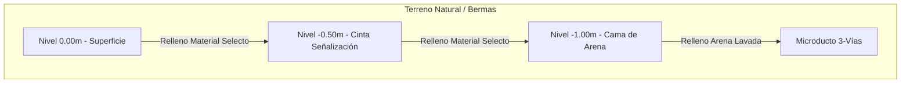

# T02: PLANOS TÍPICOS DE INSTALACIÓN - FIBRA ÓPTICA (BACKBONE)
## Proyecto APP Puerto Salgar - Barrancabermeja

**Fecha:** 30 de Enero 2026  
**Sistema:** Telecomunicaciones - Red Troncal ITS  
**Longitud:** 322 km (Ruta RN45 + Accesos)  
**Tecnología:** Microfibra Soplada (Air Blowing) en Microducto  
**Versión:** 1.0 (Construction Ready)

---

## 1. DETALLE DE ZANJA Y CANALIZACIÓN

### 1.1 Sección Transversal Típica (Trenching)

*   **Profundidad Mínima:** 1.00m (Bermas) / 1.20m (Cruces Viales).
*   **Ancho Zanja:** 0.40m a 0.50m.
*   **Ductería:** Tritubo (Microducto) HDPE configuración plana o triangular.
*   **Cinta de Peligro:** Amarilla "PELIGRO FIBRA ÓPTICA" con hilo de detección en toda la traza.

### 1.2 Especificación del Ducto
*   **Tipo:** Microducto 3 Vías (16/12mm).
*   **Código Colores:**
    *   Vía 1 (Rojo): Fibra Backbone ITS (48 Hilos Activos).
    *   Vía 2 (Azul): Fibra Reserva / Comercial.
    *   Vía 3 (Verde): Reserva Futura.

---

## 2. CÁMARAS DE EMPALME Y PASO (HANDHOLES)

### 2.1 Distribución General
*   **Separación Máxima:** 1000m en recta (para soplado eficiente).
*   **Ubicación Estratégica:** En cada poste SOS, Cámara CCTV, PMV o Gabinete ITS.

### 2.2 Tipos de Caja (HH)
*   **Tipo A (Paso/Halamiento):** Concreto/Polímero 60x60x80cm.
    *   Uso: Derivaciones a equipos ITS y empalmes rectos.
*   **Tipo B (Reserva/Nodal):** Concreto/Polímero 80x80x100cm.
    *   Uso: Cruces especiales, entradas a Peajes/CCO y reservas técnicas (coil 50m).

---

## 3. ESQUEMA DE DERIVACIÓN (ACOMETIDAS)

Cuando la fibra pasa por un equipo (ej. Poste SOS):

1.  **Sangrado (Mid-Span Access):** Se abre la chaqueta en la cámara HH más cercana.
2.  **Extracción:** Se extrae solo el Buffer asignado (generalmente Azul o Naranja).
3.  **Empalme:** Se fusionan 2 hilos al cable Drop de acometida.
4.  **Acometida:** Ducto 2" desde HH hasta base del poste SOS/CCTV.

---

## 4. LISTA DE PLANOS A GENERAR

El dibujante debe entregar los siguientes DWG/PDF georreferenciados:

| Código Plano | Nombre | Escala | Contenido |
|:-------------|:-------|:-------|:----------|
| **DWG-FO-001** | Planta General Ruta (Key Map) | 1:50,000 | Traza completa sobre ortofoto. |
| **DWG-FO-0xx** | Planta Detallada (Hojas Km a Km) | 1:2,000 | Ubicación exacta zanja, cruces y HHs. |
| **DWG-FO-DT1** | Detalles Constructivos Zanja | 1:20 | Corte típico (Blando, Rocoso, Andén). |
| **DWG-FO-DT2** | Detalles Constructivos Cámaras | 1:20 | Armado de acero y tapas HH. |
| **DWG-FO-EMP** | Diagrama de Empalmes | S/E | Asignación de hilos (Splice Plan). |

---

**Aprobado por:** Ingeniería de Detalle TM01
**Estado:** ✅ LISTO PARA DIBUJO (TECNOLOGÍA SOPLADO)
