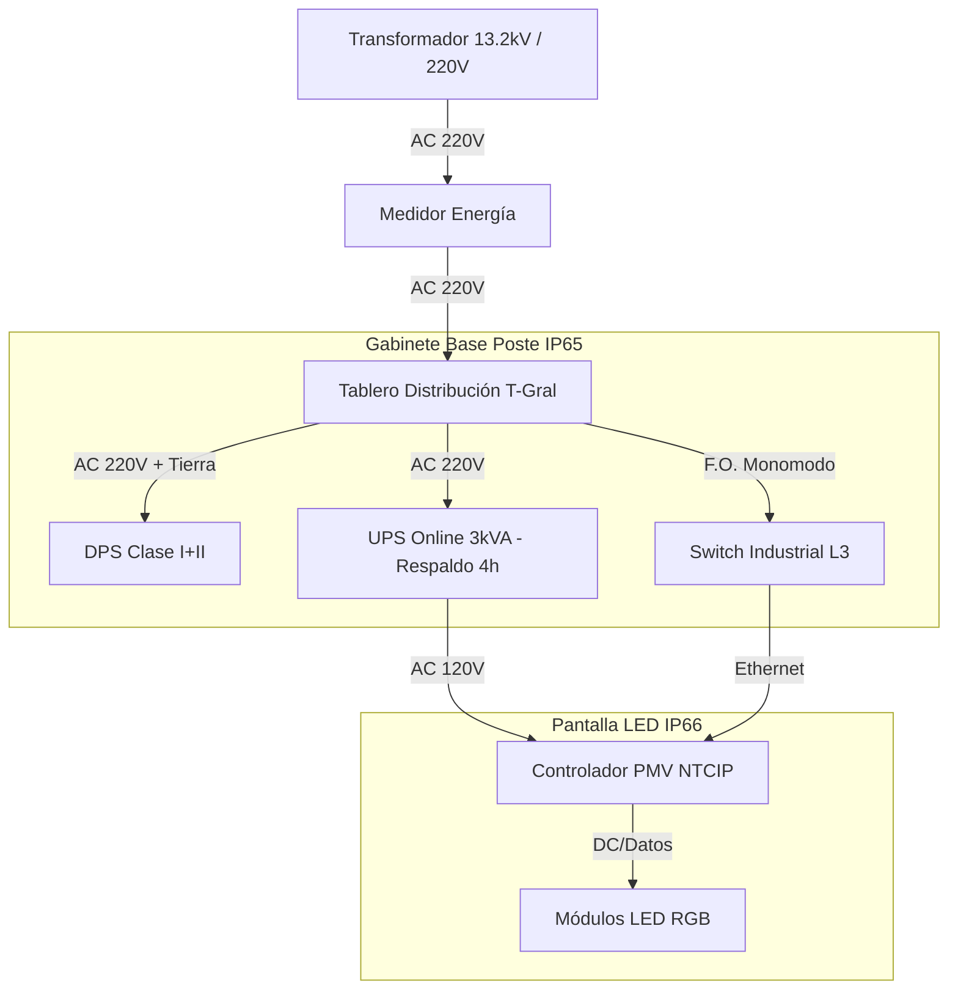

# T02: PLANOS TÍPICOS DE INSTALACIÓN - PMV (INPUT DIBUJANTE)
## Proyecto APP Puerto Salgar - Barrancabermeja

**Fecha:** 30 de Enero 2026  
**Sistema:** PMV - Paneles de Mensaje Variable  
**Uso:** Guía para elaboración de planos constructivos (Taller de Diseño)  
**Versión:** 1.0 (Construction Ready)

---

## 1. UBICACIÓN EXACTA (COORDENADAS)

Para el plano de planta general, utilizar la **Tabla Maestra Georreferenciada**:
> 📂 **Fuente:** `VII. Documentos Transversales/43_TABLA_MAESTRA_LAYOUT_PROYECTO_v1.0.md`
> *Filtrar por Item: PMV-001 a PMV-043 (Incluye Peajes)*

---

## 2. DETALLE DE MONTAJE (PÓRTICO TIPO BANDERA/TOTAL)

**Referencia Visual para Plano de Detalle:**

### 2.1 Alzado Frontal (Pórtico Estructural)
*   **Norma Diseño:** CCP-14 (Col. de Puentes 2014) / AASHTO LRFD.
*   **Altura Libre:** **5.50 metros** (Mínimo Gálibo Vertical).
*   **Ancho Efectivo:** 12 metros (Cubre dos carriles + berma).
*   **Panel LED:** Centrado sobre el eje de la calzada.
    *   *Dimensiones Panel:* 3.0m (Ancho) x 2.0m (Alto).
*   **Gabinete:** Ubicado en la columna (lado seguro), altura 1.5m.

### 2.2 Detalle de Cimentación (Zapata Típica)
> *Nota: El diseño final depende del estudio de suelos específico, este es el PRE-DISEÑO.*

*   **Zapata Aislada:** Concreto 4000 PSI.
*   **Dimensiones:** 2.0m x 2.0m x 1.8m (profundidad).
*   **Pedestal:** 0.80m x 0.80m.
*   **Pernos de Anclaje:** 8 pernos de 1-1/2" grado 55 por columna.
*   **Ductos:** 3 tubos PVC 4" (Energía, Datos Fibra, Datos Cobre/Tierra).

### 2.3 Seguridad Pasiva (Defensa Metálica)
*   **Requisito:** Instalar defensa metálica certificada (TL-3) protegiendo la columna del pórtico si está en zona despejada (<9m del borde de vía).
*   **Longitud:** Mínimo 30m de desarrollo antes del impacto.

---

## 3. DIAGRAMA UNIFILAR (CONEXIÓN)

---

## 4. LISTA DE PLANOS A GENERAR

El dibujante debe entregar los siguientes DWG/PDF:

| Código Plano | Nombre | Escala | Contenido |
|:-------------|:-------|:-------|:----------|
| **DWG-PMV-001** | Planta General Distribución | 1:10,000 | Ubicación de los 43 PMV en corredor. |
| **DWG-PMV-002** | Geometría Pórtico Típico | 1:50 | Alzado, planta y perfil del pórtico. |
| **DWG-PMV-003** | Detalle Cimentación | 1:25 | Armado de hierro zapata y pedestal. |
| **DWG-PMV-004** | Diagrama Unifilar y Comunicaciones | S/E | Tablero, UPS, DPS y Fibra Óptica. |

---

**Aprobado por:** Ingeniería de Detalle TM01
**Estado:** ✅ LISTO PARA DIBUJO
