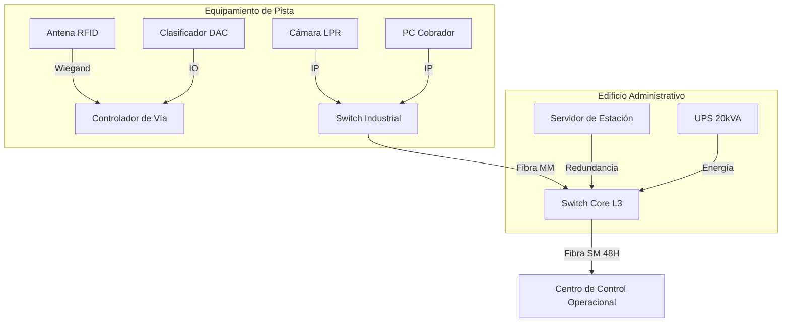

# T02: PLANOS TÍPICOS DE INSTALACIÓN - PEAJES
## Proyecto APP Puerto Salgar - Barrancabermeja

**Fecha:** 30 de Enero 2026  
**Sistema:** Recaudo Electrónico Vehicular (Peajes)  
**Cantidad:** 2 Estaciones (14 Carriles Total)  
**Ubicación:** Estación Zambito (UF2) y Estación Aguas Negras (UF3)  
**Versión:** 1.0 (Construction Ready)

---

## 1. DISTRIBUCIÓN DE CARRILES (PLANTAS TÍPICAS)

Se definen 2 estaciones idénticas de **7 carriles cada una**.

### 1.1 Configuración por Estación (7 Carriles)
*   **Sentido A:** 3 Carriles (1 Auto + 1 Mixto + 1 Manual)
*   **Sentido B:** 3 Carriles (1 Auto + 1 Mixto + 1 Manual)
*   **Reversible:** 1 Carril Central (Manual/Mixto Bidireccional)

**Total Global:** 2 Estaciones x 7 = 14 Carriles.

---

## 2. DETALLE DE ISLA (INPUT DIBUJANTE)

### 2.1 Carril Automático (Solo TAG)
*   **Antena RFID:** Pórtico metálico o Brazo a 5.5m de altura.
*   **DAC (Detector Ejes):** Sensor de fibra/piezo en pavimento.
*   **Barrera:** Alta velocidad (abierta por defecto en free-flow, cerrada si no tag).
*   **Cámara:** LPR frontal + Panorámica trasera.
*   **Semáforo:** Tipo Marquesina LED.

### 2.2 Carril Mixto (TAG + Efectivo)
*   **Caseta:** Doble altura, aire acondicionado, vidrios blindados Nivel II.
*   **Antena RFID:** En voladizo sobre caseta.
*   **Display Usuario:** Pantalla LED precio/categoría.
*   **Barrera:** Estándar (cerrada por defecto).

---

## 3. ARQUITECTURA DE COMUNICACIONES

---

## 4. LISTA DE PLANOS A GENERAR

| Código Plano | Nombre | Escala | Contenido |
|:-------------|:-------|:-------|:----------|
| **DWG-PEA-001** | Planta General Estación | 1:200 | Distribución de los 7 carriles, edificio y parqueaderos. |
| **DWG-PEA-002** | Corte Típico Carril | 1:50 | Alturas gálibo, ubicación antena, lazos inductivos. |
| **DWG-PEA-003** | Arquitectura Caseta | 1:25 | Detalles constructivos, blindaje, aire acondicionado. |
| **DWG-PEA-004** | Ductería Subterránea | 1:100 | Red de conexión Islas -> Edificio Control. |

---

## 5. REQUISITOS CIVILES

*   **Losa de Concreto:** MR45 en zona de peaje (50m antes, 50m después).
*   **Drenaje:** Cárcamos perimetrales para evitar empozamiento en sensores DAC.
*   **Gálibo:** Altura libre mínima 5.50m (Techo marquesina).

---

**Aprobado por:** Ingeniería de Detalle TM01
**Estado:** ✅ LISTO PARA DIBUJO
