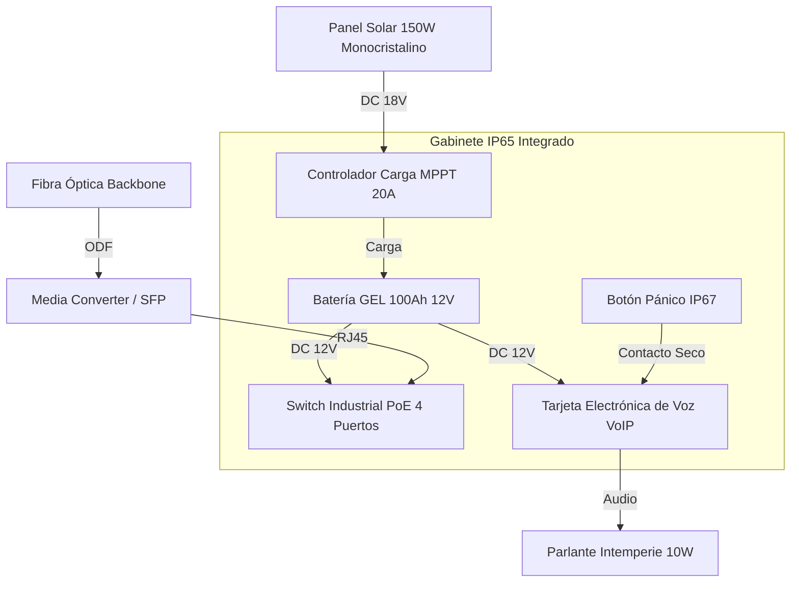

# T02: PLANOS TÍPICOS DE INSTALACIÓN - POSTES SOS (INPUT DIBUJANTE)
## Proyecto APP Puerto Salgar - Barrancabermeja

**Fecha:** 30 de Enero 2026  
**Sistema:** SOS - Postes de Auxilio (Telefonía de Emergencia)  
**Cantidad:** 98 Unidades (Tres Bolillos)  
**Tensión:** Solar 12VDC (Autónomo)  
**Versión:** 1.0 (Construction Ready)

---

## 1. UBICACIÓN EXACTA (COORDENADAS)

> 📂 **Fuente:** Detalle de Ingeniería de Tránsito (Enero 2026).
> *Nota: Se anexa listado representativo. El dibujante debe graficar la totalidad de los 98 puntos.*

**Extracto Representativo (Inicio de Tramos):**

| RUTA | UF | VIA | UBICACIÓN (PK) |
| :--- | :--- | :--- | :--- |
| **4510** | OD | DERECHA | K41+180 |
| **4510** | OD | IZQUIERDA | K43+560 |
| **4510** | OD | DERECHA | K46+550 |
| **4510** | OD | IZQUIERDA | K49+550 |
| **4510** | OD | DERECHA | K52+550 |
| **4510** | OD | IZQUIERDA | K55+500 |
| **4510** | OD | DERECHA | K58+500 |
| **4510** | OD | IZQUIERDA | K61+500 |
| **4511** | 5,1 | DERECHA | K64+510 |
| **4511** | 5,1 | DERECHA | K67+000 |
| **4511** | 12 | IZQUIERDA | K147+385 (Fin Tramo) |
| **4513** | 11 | DERECHA | K1+240 |
| **4513** | 13 | IZQUIERDA | K3+656 |
| **4513** | 11 | DERECHA | K6+050 |
| **4513** | 13 | SUR | K9+000 |

**Regla de Diseño (Tres Bolillos):**
- **SOS IMPARES:** Lado Izquierdo (Sentido N-S).
- **SOS PARES:** Lado Derecho (Sentido S-N).
- **Separación:** ~3 km entre postes del mismo lado (intercalados cada 1.5 km).

---

## 2. DETALLE DE MONTAJE (POSTE NARANJA TIPO)

**Referencia Visual para Plano de Detalle:**

### 2.1 Alzado Frontal (Poste SOS)
*   **Altura Total:** 4.90 m (Incluye mástil para panel solar/antena).
*   **Altura Botón:** 1.20 m (Accesible silla de ruedas).
*   **Material:** Acero Galvanizado + Pintura Electrostática RAL 2004 (Naranja Tráfico).
*   **Equipamiento Visible:**
    *   Flasher Estroboscópico Ámbar (Tope).
    *   Panel Solar 150W (Orientación 15° Sur).
    *   Gabinete Abatible (Frontal).
    *   Rotulado REFLECTIVO "SOS" (Vertical).

### 2.2 Detalle de Cimentación (Dado de Concreto)
*   **Dado:** Concreto Ciclopeo/Reforzado 3000 PSI.
*   **Dimensiones:** 0.60m x 0.60m x 0.80m (profundidad).
*   **Anclaje:** Canasta de pernos J de 1/2" (4 unidades).
*   **Caja de Inspección:** PVC 40x40cm adyacente para paso de fibra óptica.

---

## 3. ESQUEMA DE CONEXIÓN (ISLA SOLAR)

**Nota:** El 100% de los postes SOS nuevos son **AUTÓNOMOS**. No requieren acometida eléctrica de 120V.

### 3.1 Lista de Materiales por Sitio (BOM)
1.  **Poste Metálico 4.9m:** 1 ud.
2.  **Panel Solar 150W:** 1 ud.
3.  **Batería GEL 100Ah:** 1 ud (Alojada en base del poste).
4.  **Caja Inspección 40x40:** 1 ud.
5.  **Ducto HDPE 2":** 6 metros (Acometida Fibra desde canalización principal).

---

## 4. LISTA DE PLANOS A GENERAR

El dibujante debe entregar los siguientes DWG/PDF:

| Código Plano | Nombre | Escala | Contenido |
|:-------------|:-------|:-------|:----------|
| **DWG-SOS-001** | Planta General Distribución | 1:25,000 | Ubicación de los 98 SOS (Tres bolillos). |
| **DWG-SOS-002** | Detalle Constructivo Poste | 1:20 | Alzado, medidas, ubicación panel solar. |
| **DWG-SOS-003** | Cimentación y Caja de Paso | 1:10 | Detalle obra civil. |
| **DWG-SOS-004** | Diagrama de Conexión | S/E | Esquema eléctrico solar + datos. |
