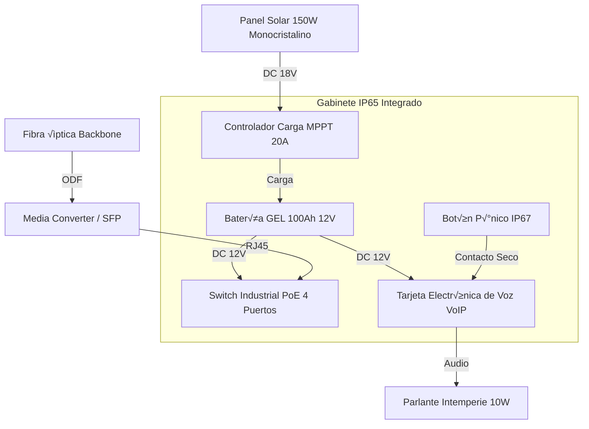

# T02: PLANOS TÍPICOS DE INSTALACIÓN - POSTES SOS (INPUT DIBUJANTE)
## Proyecto APP Puerto Salgar - Barrancabermeja

**Fecha:** 30 de Enero 2026  
**Sistema:** SOS - Postes de Auxilio (Telefonía de Emergencia)  
**Cantidad:** 98 Unidades (Tres Bolillos)  
**Tensión:** Solar 12VDC (Autónomo)  
**Versión:** 1.0 (Construction Ready)

---

## 1. UBICACIÓN EXACTA (COORDENADAS)

> 📂 **Fuente:** `VII. Documentos Transversales/43_TABLA_MAESTRA_LAYOUT_PROYECTO_v1.0.md`
> *Filtrar por Item: SOS-001 a SOS-098*

**Regla de Oro (Tres Bolillos):**
- **SOS IMPARES:** Lado Izquierdo (Sentido N-S).
- **SOS PARES:** Lado Derecho (Sentido S-N).
- **Separación:** ~3 km entre postes del mismo lado (intercalados cada 1.5 km).

---

## 2. DETALLE DE MONTAJE (POSTE NARANJA TIPO)

**Referencia Visual para Plano de Detalle:**

### 2.1 Alzado Frontal (Poste SOS)
*   **Altura Total:** 4.90 m (Incluye m√°stil para panel solar/antena).
*   **Altura Botón:** 1.20 m (Accesible silla de ruedas).
*   **Material:** Acero Galvanizado + Pintura Electrost√°tica RAL 2004 (Naranja Tr√°fico).
*   **Equipamiento Visible:**
    *   Flasher Estroboscópico Ámbar (Tope).
    *   Panel Solar 150W (Orientación 15° Sur).
    *   Gabinete Abatible (Frontal).
    *   Rotulado REFLECTIVO "SOS" (Vertical).

### 2.2 Detalle de Cimentación (Dado de Concreto)
*   **Dado:** Concreto Ciclopeo/Reforzado 3000 PSI.
*   **Dimensiones:** 0.60m x 0.60m x 0.80m (profundidad).
*   **Anclaje:** Canasta de pernos J de 1/2" (4 unidades).
*   **Caja de Inspección:** PVC 40x40cm adyacente para paso de fibra óptica.

---

## 3. ESQUEMA DE CONEXIÓN (ISLA SOLAR)

**Nota:** El 100% de los postes SOS nuevos son **AUTÓNOMOS**. No requieren acometida eléctrica de 120V.

```mermaid
graph TD
    Solar[Panel Solar 150W Monocristalino] -->|DC 18V| MPPT[Controlador Carga MPPT 20A]
    MPPT -->|Carga| Bateria[Batería GEL 100Ah 12V]
    
    subgraph GABINETE_SOS [Gabinete IP65 Integrado]
        MPPT
        Bateria
        Switch[Switch Industrial PoE 4 Puertos]
        Elec[Tarjeta Electrónica de Voz VoIP]
        Boton[Botón Pánico IP67]
    end
    
    Bateria -->|DC 12V| Switch
    Bateria -->|DC 12V| Elec
    Boton -->|Contacto Seco| Elec
    Elec -->|Audio| Parlante[Parlante Intemperie 10W]
    
    Fibra[Fibra Óptica Backbone] -->|ODF| MediaConv[Media Converter / SFP]
    MediaConv -->|RJ45| Switch
```

### 3.1 Lista de Materiales por Sitio (BOM)
1.  **Poste Met√°lico 4.9m:** 1 ud.
2.  **Panel Solar 150W:** 1 ud.
3.  **Batería GEL 100Ah:** 1 ud (Alojada en base del poste).
4.  **Caja Inspección 40x40:** 1 ud.
5.  **Ducto HDPE 2":** 6 metros (Acometida Fibra desde canalización principal).

---

## 4. LISTA DE PLANOS A GENERAR

El dibujante debe entregar los siguientes DWG/PDF:

| Código Plano | Nombre | Escala | Contenido |
|:-------------|:-------|:-------|:----------|
| **DWG-SOS-001** | Planta General Distribución | 1:25,000 | Ubicación de los 98 SOS (Tres bolillos). |
| **DWG-SOS-002** | Detalle Constructivo Poste | 1:20 | Alzado, medidas, ubicación panel solar. |
| **DWG-SOS-003** | Cimentación y Caja de Paso | 1:10 | Detalle obra civil. |
| **DWG-SOS-004** | Diagrama de Conexión | S/E | Esquema eléctrico solar + datos. |

---

**Aprobado por:** Ingeniería de Detalle TM01
**Estado:** ‚úÖ LISTO PARA DIBUJO
