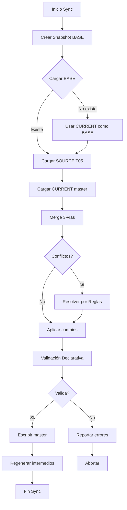

# ARQUITECTURA DE MERGE BIDIRECCIONAL - TM01 Troncal Magdalena

**Versión:** 1.0  
**Fecha:** 31 de octubre de 2025  
**Propósito:** Resolver DT-ARQUITECTURA-021 mediante sincronización bidireccional Docs ↔ Data

---

## § 1. PROBLEMA RESUELTO

### DT-ARQUITECTURA-021: Pérdida de cambios manuales

**Síntoma:** Los cambios realizados en `tm01_master_data.js` se perdían al ejecutar `sincronizar_SISTEMA_TM01_COMPLETO.ps1` porque los scripts regeneraban el archivo desde documentación base (T05) sin preservar modificaciones manuales.

**Solución:** Implementación de merge 3-vías que combina:
- **BASE** (snapshot): Estado anterior conocido
- **SOURCE** (T05): Datos de documentación técnica
- **CURRENT** (master): Estado actual con cambios manuales

---

## § 2. ARQUITECTURA DEL SISTEMA

### 2.1 Componentes Principales

```
┌─────────────────────────────────────────────────────────────┐
│                    sincronizar_SISTEMA_TM01_COMPLETO.ps1    │
│                         (Script Maestro)                     │
└───────────────────────┬─────────────────────────────────────┘
                        │
        ┌───────────────┼───────────────┐
        │               │               │
        ▼               ▼               ▼
┌──────────────┐ ┌──────────────┐ ┌──────────────┐
│ DataMapper   │ │ MergeEngine  │ │ Snapshotter  │
│              │ │              │ │              │
│ Orquesta     │ │ Merge 3-vías  │ │ Snapshots   │
│ merge        │ │ Resolución    │ │ BASE         │
└──────────────┘ └──────────────┘ └──────────────┘
        │               │
        ▼               ▼
┌──────────────┐ ┌──────────────┐
│ T05Parser    │ │ Validator    │
│ SOURCE       │ │ Reglas YAML  │
└──────────────┘ └──────────────┘
```

### 2.2 Flujo de Sincronización Bidireccional



---

## § 3. REGLAS DE RESOLUCIÓN DE CONFLICTOS

### 3.1 Campos Contractuales (Prioridad SOURCE)

Los siguientes campos se resuelven priorizando datos de T05 (documentación técnica):

- `cantidad`, `vu`, `total`, `totalCOP`
- `codigo`, `wbs`, `capitulo`
- `pk` (coordenadas)

**Razón:** Son valores técnicos contractuales que deben alinearse con documentación oficial.

### 3.2 Campos UI (Prioridad CURRENT)

Los siguientes campos preservan cambios manuales:

- `descripcion`, `observaciones`, `notas`
- `comentarios`, `estado`

**Razón:** Son anotaciones/estado gestionado por usuarios en la interfaz web.

### 3.3 Arrays (Merge Inteligente)

Arrays como `wbs`, `layout`, `presupuesto` se fusionan por ID/código único:

- Items nuevos en SOURCE o CURRENT → se añaden
- Items modificados → se aplica merge 3-vías por item
- Items solo en BASE → se eliminan si no están en SOURCE ni CURRENT

---

## § 4. USO DEL SISTEMA

### 4.1 Sincronización Normal

```powershell
.\scripts\sincronizar_SISTEMA_TM01_COMPLETO.ps1 -Force
```

**Resultado:**
- Snapshot pre-sync creado automáticamente
- Merge 3-vías ejecutado
- Conflictos resueltos por reglas
- Archivos intermedios regenerados
- Logs en `logs/sincronizacion_*.jsonl`

### 4.2 Revisar Conflictos

Si se detectan conflictos, se genera archivo:

```
logs/merge_conflicts_YYYYMMDD_HHMMSS.json
```

**Contenido:**
```json
[
  {
    "Field": "cantidad",
    "Base": 10,
    "Source": 15,
    "Current": 12,
    "Resolved": 15,
    "Reason": "Contractual (T05 tiene prioridad)"
  }
]
```

### 4.3 Rollback desde Snapshot

Si algo falla, restaurar desde snapshot:

```powershell
.\scripts\rollback.ps1
# Seleccionar snapshot por ID o fecha
```

---

## § 5. VALIDACIÓN DECLARATIVA

### 5.1 Reglas en YAML

Las reglas se definen en `rules/contract_rules.yaml`:

```yaml
rules:
  - id: AT1_SOS_CANTIDAD
    scope: wbs
    filter:
      sistema: SOS
    field: cantidad
    operator: gte
    value: 88
    severity: error
    message: "SOS: cantidad mínima contractual 88 unidades"
```

### 5.2 Ejecución

La validación declarativa se ejecuta automáticamente al final de la sincronización. Si falla, la sync se aborta y los cambios no se aplican.

---

## § 6. TESTING

### 6.1 Ejecutar Tests

```powershell
.\scripts\test_merge_system.ps1 -Verbose
```

**Tests incluidos:**
- Compare-ObjectDiff
- Resolve-Conflict (contractual y UI)
- Merge-ThreeWay
- Get-MasterDataContent
- Invoke-BidirectionalSync (DryRun)
- Snapshotter integración

### 6.2 Cobertura

- ✅ Merge simple (1 campo)
- ✅ Merge con conflictos
- ✅ Resolución por reglas
- ✅ Arrays con merge inteligente
- ✅ Carga de master data
- ✅ Integración con snapshots

---

## § 7. LÍMITES Y CONSIDERACIONES

### 7.1 Límites Actuales

- **YAML Parsing:** Requiere módulo `ConvertFrom-Yaml` o fallback a JSON
- **T05 Parsing:** Solo L3 parcialmente implementado (extensible)
- **Conflictos complejos:** Requieren revisión manual si no se resuelven automáticamente

### 7.2 Mejoras Futuras

- Parser T05 completo (FO, L2, SOS, etc.)
- Resolución de conflictos interactiva
- Historial de cambios por campo
- Dashboard de conflictos

---

## § 8. REFERENCIAS

- **DT Original:** `VII. Documentos Transversales/DTs/DT-TM01-ARQUITECTURA-021-20251024.md`
- **MergeEngine:** `scripts/modules/MergeEngine.psm1`
- **DataMapper:** `scripts/modules/DataMapper.psm1`
- **Validador:** `scripts/modules/ValidadorContractual.psm1`
- **Reglas:** `rules/contract_rules.yaml`

---

**Última actualización:** 31 de octubre de 2025  
**Versión:** 1.0
