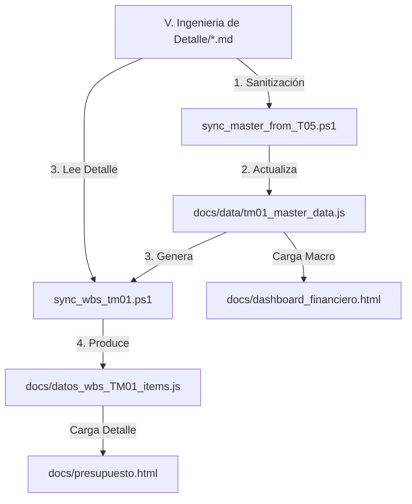

# 🔄 Flujo de Datos Dinámico: T05 → Ecosistema de Dashboards

La arquitectura de datos de este proyecto asegura que tanto la vista ejecutiva como la detallada estén siempre alineadas con la ingeniería de detalle.

## 🏗️ Proceso de Construcción y Consumo

El ecosistema se alimenta de un proceso de dos niveles:

### 1. El Dashboard Financiero (`dashboard_financiero.html`)
- **Consumo:** Lee directamente de `tm01_master_data.js`.
- **Propósito:** Ofrece una vista de **Capa 4 (Estratégica)**. Muestra métricas globales, análisis Pareto y el progreso general de la Fase 6/7.
- **Sincronización:** Se actualiza cada vez que `sync_master_from_T05.ps1` inyecta valores corregidos (como el nuevo CAPEX de Peajes o la cantidad de PMVs).

### 2. El WBS Presupuestal (`presupuesto.html`)
- **Consumo:** Lee de `datos_wbs_TM01_items.js`.
- **Propósito:** Ofrece una vista de **Capa 2 (Operativa)**. Permite ver ítem por ítem lo que extrajimos de los documentos T05.
- **Sincronización:** El script `sync_wbs_tm01.ps1` es el puente que expande los resúmenes del maestro en los miles de ítems que componen la ingeniería.

### 3. Orquestación
- El script rector es `sync_master_from_T05.ps1`. Al ejecutarlo, este actualiza los maestros y automáticamente lanza la sincronización del WBS detallado.

> [!TIP]
> Si detectas una discrepancia entre los dos dashboards, la solución suele ser ejecutar `sync_master_from_T05.ps1` para asegurar que el "efecto cascada" llegue hasta el último nivel.
