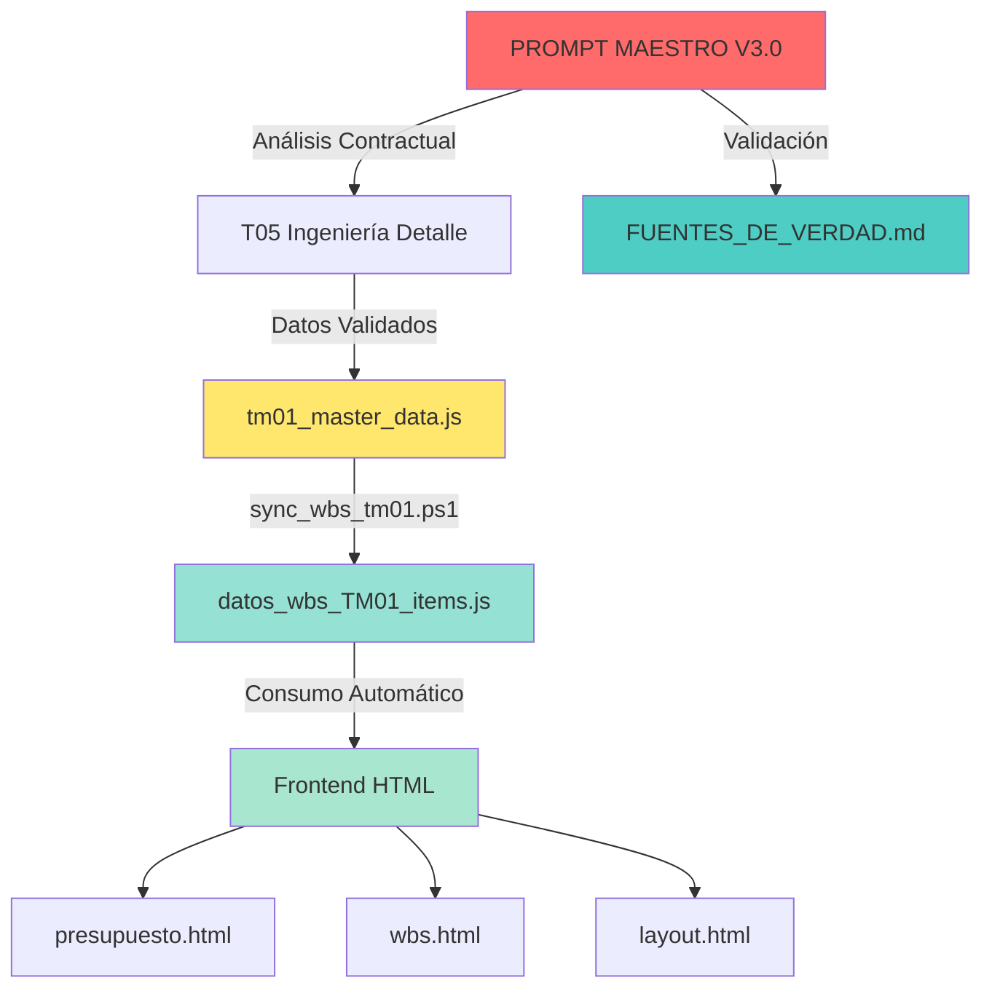

# 🔄 INTEGRACIÓN: PROMPT MAESTRO → FUENTES_DE_VERDAD → FRONTEND

**Documento:** Guía de Integración Completa  
**Versión:** 1.0  
**Fecha:** 27 de Enero 2026

---

## 📊 ARQUITECTURA DE DATOS (4 CAPAS)



---

## ═══════════════════════════════════════════════════════════════════
## CAPA 1: ANÁLISIS (PROMPT MAESTRO)
## ═══════════════════════════════════════════════════════════════════

### **Documentos Generados:**

| Documento | Propósito | Alimenta a |
|:----------|:----------|:-----------|
| `ANALISIS_[SISTEMA]_PROMPT_MAESTRO_V3.0.md` | Análisis contractual completo | T05 + FUENTES_DE_VERDAD |
| `NOTA_TECNICA_[SISTEMA]_CONSOLIDADA.md` | Especificaciones técnicas | Cliente/Interventoría |
| `GUIA_VALIDACION_FLUJO_[SISTEMA].md` | Checklist de validación | Equipo técnico |

### **Salidas Clave:**
- ✅ Cantidad total validada contractualmente
- ✅ CAPEX optimizado con ahorro demostrable
- ✅ Fuentes contractuales exactas (AT1 Línea X, AT2 Línea Y)
- ✅ Riesgos de glosa identificados y mitigados

---

## ═══════════════════════════════════════════════════════════════════
## CAPA 2: INGENIERÍA DE DETALLE (T05)
## ═══════════════════════════════════════════════════════════════════

### **Archivos a Actualizar:**

```
V. Ingenieria de Detalle/
├── 04_T05_Ingenieria_Detalle_Postes_SOS_v1.0.md
├── 05_T05_Ingenieria_Detalle_CCTV_v1.0.md
├── 06_T05_Ingenieria_Detalle_PMV_v1.0.md          ← ACTUALIZAR AQUÍ
├── 07_T05_Ingenieria_Detalle_RADAR_ETD_v1.0.md
├── 09_T05_Ingenieria_Detalle_Estaciones_Meteorologicas_v1.0.md
├── 10_T05_Ingenieria_Detalle_WIM_v1.0.md
├── 11_T05_Ingenieria_Detalle_Peaje_v1.0.md
└── 01_T05_Ingenieria_Detalle_Fibra_Optica_v1.0.md
```

### **Estructura de Tabla en T05:**

```markdown
## 4. DESGLOSE DE COMPONENTES

| Ítem | Descripción | Cantidad | Precio Unit. | Total |
|:-----|:------------|:---------|:-------------|:------|
| PMV-001 | Panel Full Matrix RGB 400mm (Pórtico) | 15 | $80,000 | $1,200,000 |
| PMV-002 | Panel Full Matrix RGB 400mm (Banderola) | 10 | $75,000 | $750,000 |
| PMV-003 | Pórtico Peaje con Panel Integrado | 2 | $85,000 | $170,000 |
| PMV-004 | Display LED Carril P10 Ámbar | 14 | $5,000 | $70,000 |

## 5. RESUMEN PRESUPUESTAL

| Componente | Unidades | CAPEX (USD) |
|:-----------|:---------|:------------|
| **TOTAL** | **43** | **$2,190,000** |
```

**⚠️ REGLA:** Las cantidades en T05 **DEBEN coincidir** con las validadas en PROMPT MAESTRO.

---

## ═══════════════════════════════════════════════════════════════════
## CAPA 3: DATOS MAESTROS (JavaScript)
## ═══════════════════════════════════════════════════════════════════

### **Archivo:** `docs/data/tm01_master_data.js`

### **Estructura de Objeto:**

```javascript
const tm01_master_data = {
  // ... otros sistemas ...
  
  pmvSummary: {
    cantidad: 43,  // ← ACTUALIZAR desde PROMPT MAESTRO
    capexUSD: 2190000,  // ← ACTUALIZAR desde T05
    capexUnitarioUSD: 50930,  // ← Calculado automáticamente
    descripcion: "Paneles de Mensajería Variable (PMV)",
    
    // NUEVO: Desglose detallado
    desglose: {
      via: { cantidad: 25, capex: 1950000 },
      peaje: { cantidad: 4, capex: 170000 },
      iprev: { cantidad: 14, capex: 70000 }
    },
    
    // NUEVO: Trazabilidad
    fuenteContractual: "AT1 L3388 + AT2 L913 + IP/REV 2021",
    validadoPor: "ANALISIS_PMV_PROMPT_MAESTRO_V2.9.md",
    fechaValidacion: "2026-01-27"
  },
  
  meteoSummary: {
    cantidad: 2,  // ← ACTUALIZAR desde PROMPT MAESTRO
    capexUSD: 4000,  // ← ACTUALIZAR desde T05
    capexUnitarioUSD: 2000,
    descripcion: "Estaciones Meteorológicas",
    
    // NUEVO: Desglose detallado
    desglose: {
      peajes: { cantidad: 2, capex: 4000, tipo: "Davis Vantage Pro2 Plus" },
      puntosCriticos: { cantidad: 4, capex: 3200, tipo: "Sensores compactos" },
      api: { cantidad: 6, opex: 600, tipo: "OpenWeather + IDEAM" }
    },
    
    // NUEVO: Trazabilidad
    fuenteContractual: "AT2 L913 (peajes) + AT2 L1136 (UFs)",
    validadoPor: "ANALISIS_METEO_PROMPT_MAESTRO_V3.0.md",
    fechaValidacion: "2026-01-27"
  }
  
  // ... otros sistemas ...
};
```

---

## ═══════════════════════════════════════════════════════════════════
## CAPA 4: SINCRONIZACIÓN WBS (Script PowerShell)
## ═══════════════════════════════════════════════════════════════════

### **Script:** `scripts/sync_wbs_tm01.ps1`

### **Función:**
1. Lee archivos T05 (Markdown)
2. Extrae tablas de componentes
3. Genera `datos_wbs_TM01_items.js` (JavaScript)
4. Frontend consume este archivo automáticamente

### **Comando:**
```powershell
cd "d:\onedrive\gdrive\TM1\0.1 ingenieria basica\0.0 FORMATOS PARA IA"
powershell -ExecutionPolicy Bypass -File "scripts\sync_wbs_tm01.ps1"
```

### **Output:**
```javascript
// docs/datos_wbs_TM01_items.js (GENERADO AUTOMÁTICAMENTE)
const wbs_items = [
  { item: '2.1.1', descripcion: 'Panel Full Matrix RGB 400mm (Pórtico)', 
    cantidad: '15', precioUnitario: '80000', total: '1200000' },
  { item: '2.1.2', descripcion: 'Panel Full Matrix RGB 400mm (Banderola)', 
    cantidad: '10', precioUnitario: '75000', total: '750000' },
  { item: '2.1.3', descripcion: 'Pórtico Peaje con Panel Integrado', 
    cantidad: '2', precioUnitario: '85000', total: '170000' },
  { item: '2.1.4', descripcion: 'Display LED Carril P10 Ámbar', 
    cantidad: '14', precioUnitario: '5000', total: '70000' }
  // ... más items ...
];
```

---

## ═══════════════════════════════════════════════════════════════════
## CAPA 5: FRONTEND (Dashboards HTML)
## ═══════════════════════════════════════════════════════════════════

### **Archivos que consumen los datos:**

#### **5.1 presupuesto.html**
```javascript
// Carga automática de datos
<script src="data/tm01_master_data.js"></script>
<script src="datos_wbs_TM01_items.js"></script>

// Renderiza tabla
function renderTabla() {
  const pmv = tm01_master_data.pmvSummary;
  
  html += `
    <tr>
      <td>PMV</td>
      <td>${pmv.cantidad}</td>
      <td>$${pmv.capexUSD.toLocaleString()}</td>
      <td>$${pmv.capexUnitarioUSD.toLocaleString()}</td>
    </tr>
  `;
}
```

#### **5.2 wbs.html**
```javascript
// Consume datos_wbs_TM01_items.js
wbs_items
  .filter(item => item.item.startsWith('2.1'))  // PMV
  .forEach(item => {
    renderWBSItem(item);
  });
```

#### **5.3 layout.html**
```javascript
// Carga marcadores de PMV en mapa
const pmvLocations = [
  { lat: 9.123, lng: -74.456, tipo: 'PMV Vía' },
  { lat: 9.234, lng: -74.567, tipo: 'PMV Peaje' },
  // ... 43 marcadores total
];
```

---

## ═══════════════════════════════════════════════════════════════════
## INTEGRACIÓN CON FUENTES_DE_VERDAD.md
## ═══════════════════════════════════════════════════════════════════

### **Cómo se usa FUENTES_DE_VERDAD.md:**

**FUENTES_DE_VERDAD.md NO alimenta el frontend directamente.**  
Es un **documento de metodología** que explica:

1. ✅ **Jerarquía de fuentes:** AT1 > T05 > master_data.js
2. ✅ **Workflow obligatorio:** T05 → sync_wbs → Frontend
3. ✅ **Errores comunes:** No ejecutar sync_wbs, hardcodear valores
4. ✅ **Casos de estudio:** PMV (39 vs 43), METEO (API vs físico)

### **Relación con PROMPT MAESTRO:**

```
PROMPT MAESTRO V3.0 (Metodología de análisis)
        ↓
ANALISIS_[SISTEMA]_PROMPT_MAESTRO_V3.0.md (Resultado del análisis)
        ↓
FUENTES_DE_VERDAD.md (Caso de estudio documentado)
        ↓
T05 (Datos validados aplicados)
        ↓
master_data.js (Datos consolidados)
        ↓
sync_wbs_tm01.ps1 (Sincronización)
        ↓
Frontend (Visualización)
```

---

## ═══════════════════════════════════════════════════════════════════
## EJEMPLO COMPLETO: PMV (Paso a Paso)
## ═══════════════════════════════════════════════════════════════════

### **PASO 1: Ejecutar PROMPT MAESTRO V3.0**

```
Input: "Analizar PMV según contrato"
Output: ANALISIS_PMV_PROMPT_MAESTRO_V2.9.md
Resultado: 43 unidades (25 + 4 + 14), $2.19M USD
```

---

### **PASO 2: Actualizar T05**

**Archivo:** `V. Ingenieria de Detalle/06_T05_Ingenieria_Detalle_PMV_v1.0.md`

**Cambio:**
```diff
- | PMV-001 | Panel Full Matrix RGB 400mm | 39 | $60,512 | $2,360,000 |
+ | PMV-001 | Panel Full Matrix RGB 400mm (Pórtico) | 15 | $80,000 | $1,200,000 |
+ | PMV-002 | Panel Full Matrix RGB 400mm (Banderola) | 10 | $75,000 | $750,000 |
+ | PMV-003 | Pórtico Peaje con Panel Integrado | 2 | $85,000 | $170,000 |
+ | PMV-004 | Display LED Carril P10 Ámbar | 14 | $5,000 | $70,000 |
```

---

### **PASO 3: Actualizar master_data.js**

**Archivo:** `docs/data/tm01_master_data.js`

**Cambio:**
```diff
  pmvSummary: {
-   cantidad: 39,
-   capexUSD: 2596000,
+   cantidad: 43,
+   capexUSD: 2190000,
+   desglose: {
+     via: { cantidad: 25, capex: 1950000 },
+     peaje: { cantidad: 4, capex: 170000 },
+     iprev: { cantidad: 14, capex: 70000 }
+   },
+   fuenteContractual: "AT1 L3388 + AT2 L913 + IP/REV 2021",
+   validadoPor: "ANALISIS_PMV_PROMPT_MAESTRO_V2.9.md"
  }
```

---

### **PASO 4: Ejecutar sync_wbs_tm01.ps1**

```powershell
powershell -ExecutionPolicy Bypass -File "scripts\sync_wbs_tm01.ps1"
```

**Resultado:**
- `datos_wbs_TM01_items.js` actualizado con 43 PMV
- Frontend listo para mostrar datos actualizados

---

### **PASO 5: Verificar Frontend**

**Abrir:** `docs/presupuesto.html`

**Verificar:**
- Cantidad PMV: 43 ✅
- CAPEX PMV: $2,190,000 ✅
- Desglose: 25 vía + 4 peaje + 14 IP/REV ✅

---

### **PASO 6: Documentar en FUENTES_DE_VERDAD.md**

**Agregar caso de estudio:**

```markdown
## 📘 CASO DE ESTUDIO: PANELES DE MENSAJERÍA VARIABLE (PMV)

### Problema Inicial:
T05 contenía 39 unidades, pero análisis contractual reveló 43.

### Aplicación PROMPT MAESTRO V3.0:
- AT1 L3388: 25 PMV vía
- AT2 L913: 4 PMV peaje
- IP/REV 2021: 14 displays

### Resultado:
43 unidades, $2.19M USD (ahorro $406k vs. presupuesto anterior)

### Lecciones Aprendidas:
1. Contract-First Architecture funciona
2. Doble Sombrero detecta errores
3. Normativa sobreviniente es obligatoria
```

---

## ✅ CHECKLIST DE INTEGRACIÓN COMPLETA

- [ ] **PROMPT MAESTRO ejecutado** → Análisis contractual completo
- [ ] **T05 actualizado** → Cantidades y precios validados
- [ ] **master_data.js actualizado** → Datos consolidados con trazabilidad
- [ ] **sync_wbs_tm01.ps1 ejecutado** → datos_wbs_TM01_items.js generado
- [ ] **Frontend verificado** → presupuesto.html, wbs.html, layout.html
- [ ] **DT creada** → Decisión Técnica documentando cambio
- [ ] **FUENTES_DE_VERDAD.md actualizado** → Caso de estudio agregado
- [ ] **Git commit y push** → Cambios versionados
- [ ] **Vercel auto-deploy** → Frontend en producción

---

## 📊 RESUMEN EJECUTIVO

**Flujo de Datos:**
```
PROMPT MAESTRO → T05 → master_data.js → sync_wbs → Frontend
```

**Documentos de Soporte:**
```
FUENTES_DE_VERDAD.md (Metodología)
ANALISIS_[SISTEMA]_PROMPT_MAESTRO_V3.0.md (Análisis)
DT-TM01-[SISTEMA]-XXX.md (Decisión Técnica)
```

**Resultado:**
- ✅ Datos validados contractualmente
- ✅ Frontend actualizado automáticamente
- ✅ Trazabilidad completa
- ✅ Optimización de costos documentada

---

**Última actualización:** 27 de Enero 2026  
**Versión:** 1.0  
**Estado:** ✅ METODOLOGÍA COMPLETA DOCUMENTADA
